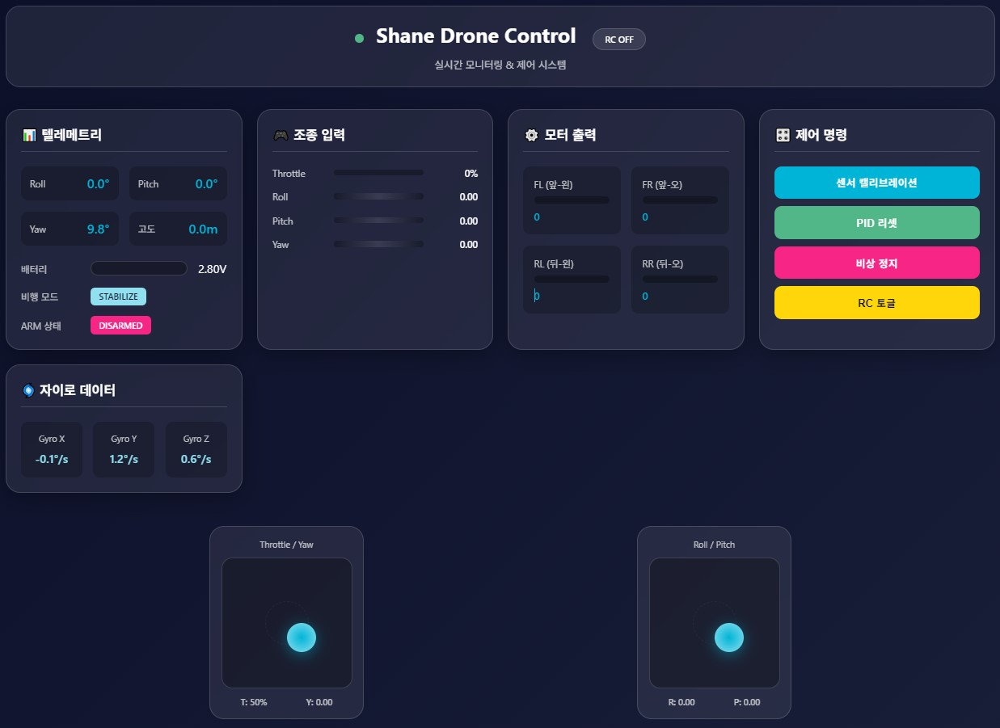

# Pavo Pico Drone

## 2025-08-14
	- Arduino IDE => PlatformIO project로 변경
	- 더 다양한 기능 지원

## 2025-08-24
	- ESP32Dev 추가 - test code
	- PavoPicoDrone 전체적으로 수정해야함.

## 2025-08-25
	- Compile 성공
	- VSCode + PlatformIO + Arduino Nano ESP32 S3
	- DIY Pavo Pico Drone - Arduino Nano ESP32 + MPU9250
	- BETAFPV 1102 14000KV 모터 + Walksnail Avatar HD V2

## 2025-08-27
	- PavoPicoDrone => ShaneDrone으로 변경
	- 저장소 변경
## git remote set-url origin git@github.com:사용자명/저장소명.git

	- 3.5_Wokwi 오류 수정 : 사용 함수 미설정

## 2025-09-01
	- Telemetry를 Web 서버로 확대

### 5. 웹 대시보드 테스트
	이제 센서 오류와 관계없이 시스템이 부팅되므로:
	- 시리얼 모니터에서 WiFi AP 생성 확인
	- 스마트폰/PC에서 "Shane_Drone" WiFi에 연결
	- 브라우저에서 http://192.168.4.1 접속
	- 시뮬레이션 데이터로 대시보드 작동 확인

### 6. 2025-09-13
	- Arduino nano esp32 compile, upload, monitor
	- http://192.168.4.1 웹 서버 접속 완료

###	Chrome vs Edge 문제
	- Chrome에서 chrome://net-internals/#dns 접속하여 DNS 캐시 클리어
	- 또는 Chrome에서 http://192.168.4.1 대신 http://192.168.4.1/ (마지막 슬래시 추가) 시도

### 7. 2025-09-14
	- communication.cpp에서 web part 분리 : web.cpp, web.h
	- web => async(Mobile), legacy(PC)로 분리
	- platformio.ini에서 사용하는 타겟에 따라 선택적 compile
	- serial CLI는 차단 : communicationLoop.handleSerialCLI() - 사용하기 불편하고 의미 없다.

	=> web_async_v0.1.cpp + drone_3d_viewer.html
	=> /src/web_async.cpp, /data/index.html, /data/css/style.css, /data/js/drone-controller.js
	=> 3D Drone Model을 적용 한  후 웹적속인 안되는 상황 발생.
	=> spiffs를 사용하여 웹 접속하는 방식으로 변경했다.
	=> build, upload, Serial Monitor 정상 수행
	=> Serial Monitor 정상 출력 상태이다.
	=> http://192.168.4.1 접속 안된다?

### 8. 2025-09-15
	
# SPIFFS 이미지만 빌드
pio run --target buildfs --environment arduino_nano_esp32-mobile

# 모든 터미널과 모니터링 프로그램 종료 후
pio pkg exec --package tool-esptoolpy -- esptool.py --chip esp32s3 --port COM10 --baud 115200 write_flash 0x290000 .pio\build\arduino_nano_esp32-mobile\spiffs.bin

### 9. 2025-09-20
	- 3D model 없이 정상 동작하는 버전
	- web_async.cpp에 html, css, cpp 혼재
```
=== 시스템 상태 ===
systemArmed: false
systemReady: true
WiFi 클라이언트: 1
WiFi 상태: AP 모드
WiFi SSID: Shane_Drone
Free heap: 229840 bytes
배터리: 0.09V
[RC APPLY] thr=0.50 roll=0.00 pitch=0.00 yaw=0.00
[RC APPLY] thr=0.50 roll=0.00 pitch=0.00 yaw=0.00
[RC APPLY] thr=0.50 roll=0.00 pitch=0.00 yaw=0.00
[RC APPLY] thr=0.50 roll=0.00 pitch=0.00 yaw=0.00
WARNING: 센서 오류 감지
```

	- web_async.cpp에서 html+javascript 코드 분리
	- SPIFFS or LittleFS를 사용한 외부 index.html, script.js, css를 사용하는 버젼은 안된다.
	- 아두이노에서 실행하기 어렵다.(부하가 많이 걸린다. /data/* 여기 소스 사용)
	- web_async.cpp, drone_simple_html.h로 분리하여 사용
	- drone_3d_html.h, drone_simple_html.h 사용은 platfromio.ini에서 옵션으로 선택하게 함.
	- web_async.cpp 대신 web_async_working.cpp 사용 가능 : platfromio.ini에서 옵션으로 선택
	- drone_3d_html.h 사용은 수정이 필요하다.(그냥 시각화만 되고 있다.)
	=> 앞으로 조이스틱 움직임을 정교하게 디버깅 하는 작업 진행

### 10. 2025-09-21
ShaneDrone/
├─ platformio.ini
├─ src/
│  ├─ main.cpp
│  └─ web_async.cpp        // 아래 새 버전으로 교체
├─ include/
│  └─ web.h                // (기존과 동일 가정)
├─ data_running/           // ← LittleFS에 올라가는 기본 web
│  ├─ index.html
│  ├─ style.css
   ├─ app.js
│  └─ connecttest.txt
├─ data/                   // ← LittleFS에 올라가는 Shane Drone Control
│  ├─ index.html
│  ├─ style.css
   ├─ app.js


### esptool로 upload 변경하면 오류 발생
### ; 펌웨어와 파일시스템 업로드는 반드시 같은 env 로 실행
### ; pio run -e arduino_nano_esp32-mobile -t upload      # 펌웨어
### ; pio run -e arduino_nano_esp32-mobile -t uploadfs    # LittleFS(data/)

### ; pio run -e arduino_nano_esp32-mobile -t uploadfs --upload-port COM7

Serial port COM6

A fatal error occurred: Could not open COM6, the port is busy or doesn't exist.
(could not open port 'COM6': OSError(22, '세마포 제한 시간이 만료되었습니다.', None, 121))

### 11. 2025-09-23
	- LittleFS로 구축 성공.
	- /data 대신하여 /web 설정은 안된다.(LitteFS 인식하지 못한다.)
	- 위의 펨웨어 upload, LittleFS uploadfs 각각 실행
	- data/index.html, style.css, app.js 필수
	- Shane Drone Control 설치 완료
	- Serial Port 연결 오류 => upload_port=COM*, monitor_port=COM* 으로 auto detect로 설정
	- RC 토글 : RC ON 안되는 상태


### 12. 2025-09-28
	- LittleFS은 성능 문제로 동작하지 않는다.
	- header 파일에 javascript, html, css 통합 시용으로 함.
	- drone_3d_html.h 사용 + web_async_3d.cpp
	- drone_3d_html.h 분리 : drone_css.h, drone_html.h, drone_js.h + web_async.cpp
	- 모바일에서 가상 드론이비지가 나타나지 않는다.
	- RC 토글 버튼이 동작하지 않는다.
	- 가상 조이스틱 입력이 출력되지 않는다.