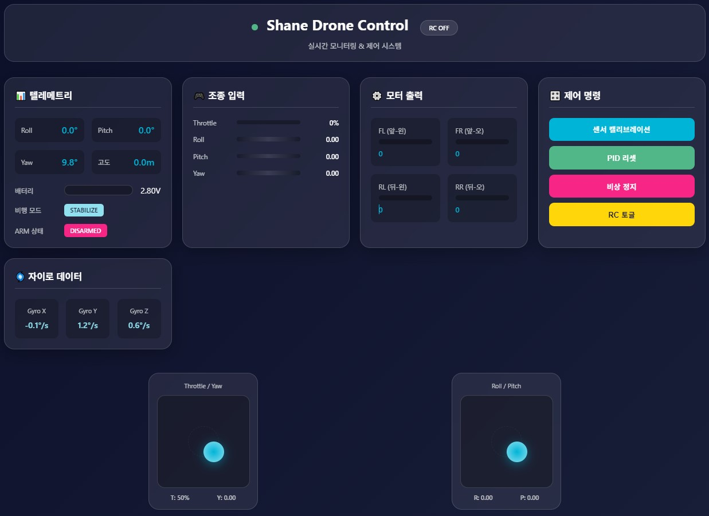
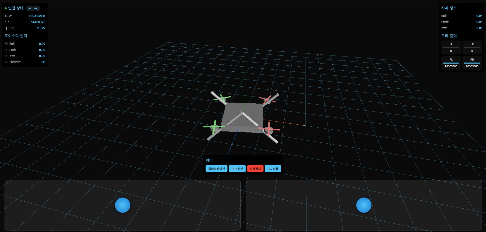
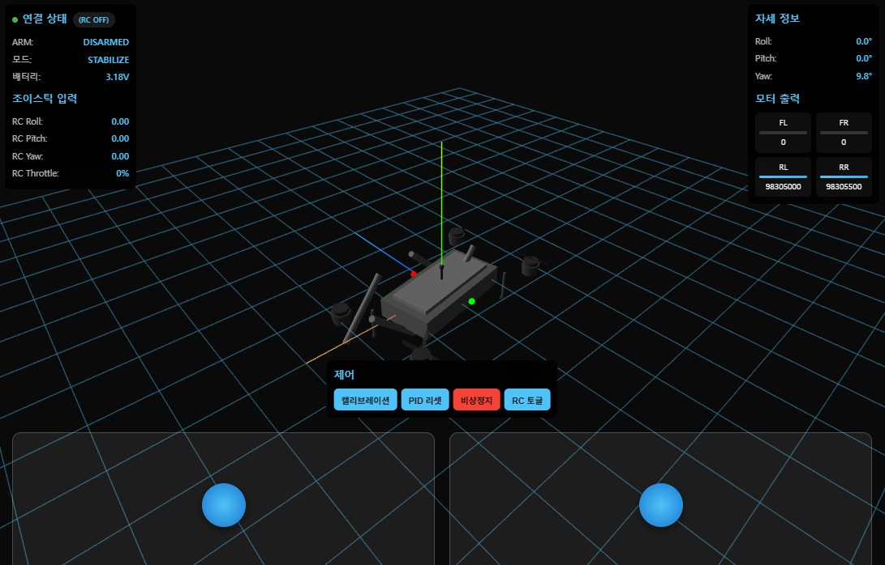
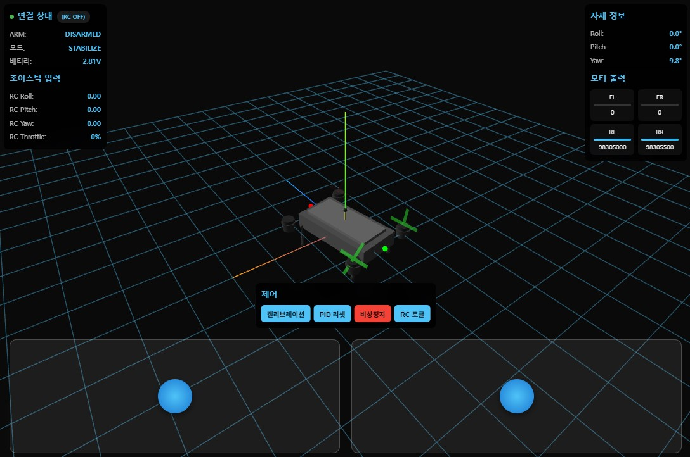
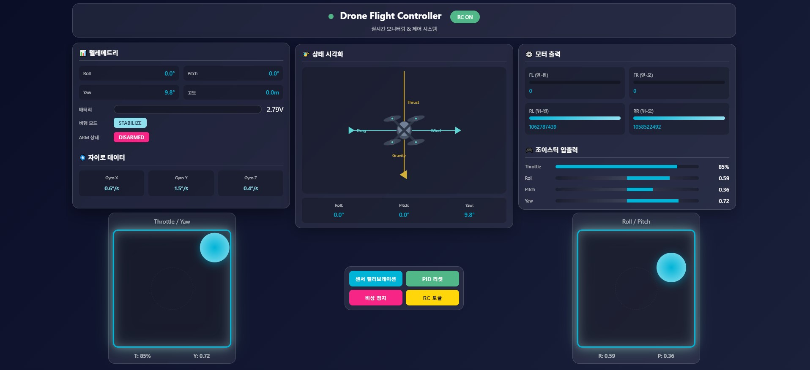

# Pavo Pico Drone

<!-- npm install -g @anthropic-ai/claude-code -->
> claude --dangerously-skip-permissions

● Bash(cmd.exe /c "tasklist /fi \"imagename eq pio.exe\" 2>&1")
  ⎿  Image Name                     PID Session Name        Session#    Mem Usage
     ========================= ======== ================ =========== ============
     pio.exe                       8364 Console                    1      3,636 K

● pio.exe 프로세스가 하나 실행 중입니다 — 이게 COM4를 잡고 있는 것입니다. 종료합니다:

● Bash(cmd.exe /c "taskkill /F /PID 8364 2>&1")
  ⎿  SUCCESS: The process with PID 8364 has been terminated.

## 2025-08-14
	- Arduino IDE => PlatformIO project로 변경
	- 더 다양한 기능 지원

## 2025-08-24
	- ESP32Dev 추가 - test code
	- PavoPicoDrone 전체적으로 수정해야함.

## 2025-08-25
	- Compile 성공
	- VSCode + PlatformIO + Arduino Nano ESP32 S3
	- DIY Pavo Pico Drone - Arduino Nano ESP32 + MPU9250
	- BETAFPV 1102 14000KV 모터 + Walksnail Avatar HD V2

## 2025-08-27
	- PavoPicoDrone => ShaneDrone으로 변경
	- 저장소 변경
## git remote set-url origin git@github.com:사용자명/저장소명.git

	- 3.5_Wokwi 오류 수정 : 사용 함수 미설정

## 2025-09-01
	- Telemetry를 Web 서버로 확대

### 5. 웹 대시보드 테스트
	이제 센서 오류와 관계없이 시스템이 부팅되므로:
	- 시리얼 모니터에서 WiFi AP 생성 확인
	- 스마트폰/PC에서 "Shane_Drone" WiFi에 연결
	- 브라우저에서 http://192.168.4.1 접속
	- 시뮬레이션 데이터로 대시보드 작동 확인

### 6. 2025-09-13
	- Arduino nano esp32 compile, upload, monitor
	- http://192.168.4.1 웹 서버 접속 완료

###	Chrome vs Edge 문제
	- Chrome에서 chrome://net-internals/#dns 접속하여 DNS 캐시 클리어
	- 또는 Chrome에서 http://192.168.4.1 대신 http://192.168.4.1/ (마지막 슬래시 추가) 시도

### 7. 2025-09-14
	- communication.cpp에서 web part 분리 : web.cpp, web.h
	- web => async(Mobile), legacy(PC)로 분리
	- platformio.ini에서 사용하는 타겟에 따라 선택적 compile
	- serial CLI는 차단 : communicationLoop.handleSerialCLI() - 사용하기 불편하고 의미 없다.

	=> web_async_v0.1.cpp + drone_3d_viewer.html
	=> /src/web_async.cpp, /data/index.html, /data/css/style.css, /data/js/drone-controller.js
	=> 3D Drone Model을 적용 한  후 웹적속인 안되는 상황 발생.
	=> spiffs를 사용하여 웹 접속하는 방식으로 변경했다.
	=> build, upload, Serial Monitor 정상 수행
	=> Serial Monitor 정상 출력 상태이다.
	=> http://192.168.4.1 접속 안된다?

### 8. 2025-09-15
	
# SPIFFS 이미지만 빌드
pio run --target buildfs --environment arduino_nano_esp32-mobile

# 모든 터미널과 모니터링 프로그램 종료 후
pio pkg exec --package tool-esptoolpy -- esptool.py --chip esp32s3 --port COM10 --baud 115200 write_flash 0x290000 .pio\build\arduino_nano_esp32-mobile\spiffs.bin

### 9. 2025-09-20
	- 3D model 없이 정상 동작하는 버전
	- web_async.cpp에 html, css, cpp 혼재
```
=== 시스템 상태 ===
systemArmed: false
systemReady: true
WiFi 클라이언트: 1
WiFi 상태: AP 모드
WiFi SSID: Shane_Drone
Free heap: 229840 bytes
배터리: 0.09V
[RC APPLY] thr=0.50 roll=0.00 pitch=0.00 yaw=0.00
[RC APPLY] thr=0.50 roll=0.00 pitch=0.00 yaw=0.00
[RC APPLY] thr=0.50 roll=0.00 pitch=0.00 yaw=0.00
[RC APPLY] thr=0.50 roll=0.00 pitch=0.00 yaw=0.00
WARNING: 센서 오류 감지
```

	- web_async.cpp에서 html+javascript 코드 분리
	- SPIFFS or LittleFS를 사용한 외부 index.html, script.js, css를 사용하는 버젼은 안된다.
	- 아두이노에서 실행하기 어렵다.(부하가 많이 걸린다. /data/* 여기 소스 사용)
	- web_async.cpp, drone_simple_html.h로 분리하여 사용
	- drone_3d_html.h, drone_simple_html.h 사용은 platfromio.ini에서 옵션으로 선택하게 함.
	- web_async.cpp 대신 web_async_working.cpp 사용 가능 : platfromio.ini에서 옵션으로 선택
	- drone_3d_html.h 사용은 수정이 필요하다.(그냥 시각화만 되고 있다.)
	=> 앞으로 조이스틱 움직임을 정교하게 디버깅 하는 작업 진행

### 10. 2025-09-21
ShaneDrone/
├─ platformio.ini
├─ src/
│  ├─ main.cpp
│  └─ web_async.cpp        // 아래 새 버전으로 교체
├─ include/
│  └─ web.h                // (기존과 동일 가정)
├─ data_running/           // ← LittleFS에 올라가는 기본 web
│  ├─ index.html
│  ├─ style.css
   ├─ app.js
│  └─ connecttest.txt
├─ data/                   // ← LittleFS에 올라가는 Shane Drone Control
│  ├─ index.html
│  ├─ style.css
   ├─ app.js


### esptool로 upload 변경하면 오류 발생
### ; 펌웨어와 파일시스템 업로드는 반드시 같은 env 로 실행
### ; pio run -e arduino_nano_esp32-mobile -t upload      # 펌웨어
### ; pio run -e arduino_nano_esp32-mobile -t uploadfs    # LittleFS(data/)

### ; pio run -e arduino_nano_esp32-mobile -t uploadfs --upload-port COM7

Serial port COM6

A fatal error occurred: Could not open COM6, the port is busy or doesn't exist.
(could not open port 'COM6': OSError(22, '세마포 제한 시간이 만료되었습니다.', None, 121))

### 11. 2025-09-23
	- LittleFS로 구축 성공.
	- /data 대신하여 /web 설정은 안된다.(LitteFS 인식하지 못한다.)
	- 위의 펨웨어 upload, LittleFS uploadfs 각각 실행
	- data/index.html, style.css, app.js 필수
	- Shane Drone Control 설치 완료
	- Serial Port 연결 오류 => upload_port=COM*, monitor_port=COM* 으로 auto detect로 설정
	- RC 토글 : RC ON 안되는 상태


### 12. 2025-09-28
	- LittleFS은 성능 문제로 동작하지 않는다.
	- header 파일에 javascript, html, css 통합 시용으로 함.
	- drone_3d_html.h 사용 + web_async_3d.cpp
	- drone_3d_html.h 분리 : drone_css.h, drone_html.h, drone_js.h + web_async.cpp
	- 모바일에서 가상 드론이비지가 나타나지 않는다.
	- RC 토글 버튼이 동작하지 않는다.
	- 가상 조이스틱 입력이 출력되지 않는다.

### 13. 2025-10-04
	- LittleFS로 파일 시스템 구축 : 업데이트 이미지
	- web_async.cpp, platformio.ini, partitions.csv
	- /data/drone.css, /data/drone.js, /data/index.html





### 최종 모델
- 빨간색 포인터가 있는 쪽이 전방향 이다.
- 초록색 포인터가 후방 이다.



### 14. 2025-10-05
	- 조이스틱 움직임 : 조이스틱 입력에 렌더링 된다.
	- Flight Controller 모델 이미지 구성
	- 상태 시각화
	- 조이스틱 입력창, 출력창
	- 모바일 모드 추가

### 최종 모델


### 15. 2025-10-11
	- 모든 방법을 동원해도 GY-9250(MPU9250) 모듈로는 Arduino nano esp32와 I2C 통신이 안된다.
	- 모듈 불량으로 생각된다.(재 구매 필요)
	- 재구매 후 MPU9250 프로젝트에서 연결 시험 해 보면 된다.

### 16. 2025-11-01
	- 고장인가 해서 재구매한 MPU9250으로 Arduino nano esp32와 연동 테스트 했는데 정상 동작 하지 않는다.
	- I2C 장치를 찾지 못한다.
	- copy backup/i2c_debug_test.cpp src/main.cpp
	- pio run -t upload -t monitor
	
```
1️⃣  I2C 설정
─────────────────────────────────────
I2C 설정: Wire.begin() - 기본 핀 사용
  Arduino Nano ESP32 기본 I2C:
    D11 (GPIO11) = SDA
    D12 (GPIO12) = SCL

2️⃣  Wire 라이브러리 초기화
─────────────────────────────────────
  호출: Wire.begin()  // 인자 없음!
[  4176][I][esp32-hal-i2c.c:75] i2cInit(): Initialising I2C Master: sda=11 scl=12 freq=100000
  ✓ Wire 초기화 성공!
  ✓ 클럭: 100kHz
  ✓ 타임아웃: 100ms

3️⃣  I2C 버스 스캔
─────────────────────────────────────
┌────────┬──────────────────────┐
│ 주소   │ 상태                 │
├────────┼──────────────────────┤
└────────┴──────────────────────┘
총 0개의 I2C 장치 발견

╔════════════════════════════════════════╗
║   I2C 장치 발견 실패!                ║
╚════════════════════════════════════════╝
```
	- 브레드보드 구매 : BusBoard BB830
	- 멀티메터 구매 : UNI-T UT33D

### 17. 2026-03-15
	- 신규 업데이트 : 21. ShaneDrone 전체 코드 로직 가이드.md

# 18. 2026-03-22

## 권장 사항

  - 특정 환경만 업로드하려면 -e 플래그로 환경을 지정하세요:
  # DFU (RESET 2번 후)
  pio run -e arduino_nano_esp32-dfu -t upload

  # JTAG (WinUSB 드라이버 설치 후)
  pio run -e arduino_nano_esp32-jtag -t upload

  # OTA (Shane_Drone WiFi 연결 후)
  pio run -e arduino_nano_esp32-ota -t upload
  - 환경 미지정 시 모든 환경을 시도하므로 실패가 많아집니다.

  현재 DFU로 성공했으니 펌웨어는 최신 상태입니다.

====================================================================== [SUCCESS] Took 35.16 seconds ======================================================================
Environment              Status    Duration
-----------------------  --------  ------------
arduino_nano_esp32-jtag  SUCCESS   00:00:35.158
====================================================================== 1 succeeded in 00:00:35.158 ======================================================================

● JTAG 업로드 성공입니다. ✅

  ** Verify OK **  (4회 모두 검증 완료)
  [SUCCESS] Took 35.16 seconds

  펌웨어가 정상적으로 플래시됐습니다. JTAG은 정상 동작 중이니 앞으로 표준 업로드 방법으로 사용하면 됩니다.

❯ Yaw:
20780.6°
이 값이 빠르게 변한다.

● 시뮬레이션 모드 확정입니다.

  Yaw가 20780° → 계속 증가 중 = t * 10.0 패턴 (부팅 후 약 34분 경과).

  ---
  원인 진단을 위해 시리얼 모니터가 필요합니다.

  Zadig에서 드라이버를 CDC로 전환 후 부팅 로그를 봐야 정확한 원인을 알 수 있습니다.

  Zadig 절차:
  1. Zadig 실행
  2. NanoESP32 장치 선택
  3. 드라이버를 CDC (Serial) 로 변경 → Install
  4. COM4 확인 후:
  pio device monitor -p COM4 -b 115200
  5. USB 재연결 (보드 리셋)

  부팅 시 출력되는 I2C 스캔 결과를 여기에 붙여넣어 주세요. 그러면 정확히 어디서 실패하는지 알 수 있습니다.

❯ 절차를 좀 더 자세히 알려줘

● Zadig 드라이버 전환 절차 

  ---
  1단계: Zadig 다운로드 & 실행
  - 구글에서 Zadig 검색 후 zadig.akeo.ie 에서 다운로드
  - zadig-2.x.exe 실행 (설치 불필요)

  ---
  2단계: 모든 장치 표시
  - 메뉴 Options → List All Devices 체크

  ---
  3단계: 장치 선택
  - 드롭다운에서 USB JTAG/serial debug unit (Interface 2) 선택
    - Interface 0 아님 → Interface 2 선택

  ---
  4단계: 드라이버 변경
  - 왼쪽(현재): WinUSB 또는 usbser
  - 오른쪽(변경): 화살표 클릭해서 usbser (CDC) 선택
  - Replace Driver 클릭
  - 완료까지 1~2분 대기

  ---
  5단계: COM 포트 확인
  - 윈도우 장치 관리자 열기 (Win + X → 장치 관리자)
  - 포트 (COM & LPT) 항목에 USB Serial Device (COM4) 확인
  - COM 번호 기억

  ---
  6단계: 시리얼 모니터 연결
  pio device monitor -p COM4 -b 115200
  (COM 번호가 다르면 해당 번호로 변경)

  ---
  7단계: 보드 리셋
  - USB 케이블 뽑았다가 다시 꽂기
  - 부팅 로그가 출력되면 여기에 붙여넣기

❯ 포트 (COM & LPT) 항목에 USB Serial Device (COM4) 확인 ?

● Bash(powershell -Command "Get-PnpDevice -Class Ports | Select-Object Status, FriendlyName | Out-String")
  ⎿  Status  FriendlyName
     ------  ------------
     OK      표준 Bluetooth에서 직렬 링크(COM5)
     … +4 lines (ctrl+o to expand)

● COM4가 아닌 COM9입니다.   

  USB 직렬 장치 (COM9) 가 연결되어 있습니다. Status가 Unknown이지만 시리얼 모니터는 시도해볼 수 있습니다:

  pio device monitor -p COM9 -b 115200

  USB 케이블 뽑았다가 다시 꽂은 후 위 명령 실행해주세요.

● 두 가지 문제 발견:

  1. Arduino DFU 장치 감지 → 보드가 DFU 모드에 진입됨 (RESET 눌렸을 가능성)
  2. USB JTAG/serial debug unit → Unknown으로 바뀜 (Zadig 변경 영향)
  3. COM9 → Unknown 상태 (드라이버 미완료)

  ---
  순서대로 진행:

  1단계: USB 재연결 (RESET 누르지 말 것)
  - USB 케이블 뽑기 → 5초 후 다시 꽂기

  2단계: 재연결 후 COM 포트 재확인
  powershell -Command "Get-PnpDevice -Class Ports | Select-Object 	Status, FriendlyName | Out-String"

  결과 붙여넣어 주세요.

● COM9가 PlatformIO에도 안 보입니다. 드라이버가 제대로 설치 안 된 상태입니다.

  ---
  장치 관리자에서 수동 드라이버 설치:

  1. Win + X → 장치 관리자
  2. 포트 (COM & LPT) 펼치기
  3. USB 직렬 장치 (COM9) 우클릭 → 드라이버 업데이트
  4. 컴퓨터에서 드라이버 찾아보기 클릭
  5. 컴퓨터의 장치 드라이버 목록에서 직접 선택 클릭
  6. 목록에서 USB 직렬 장치 선택 → 다음

  ---
  설치 완료 후:

  pio device list

  결과 붙여넣어 주세요.

# 19. 2026-03-23