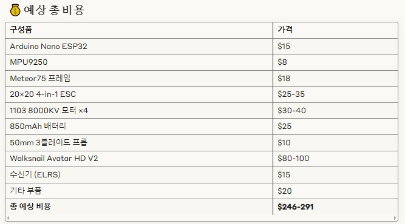
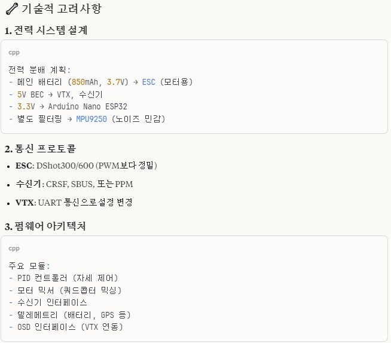
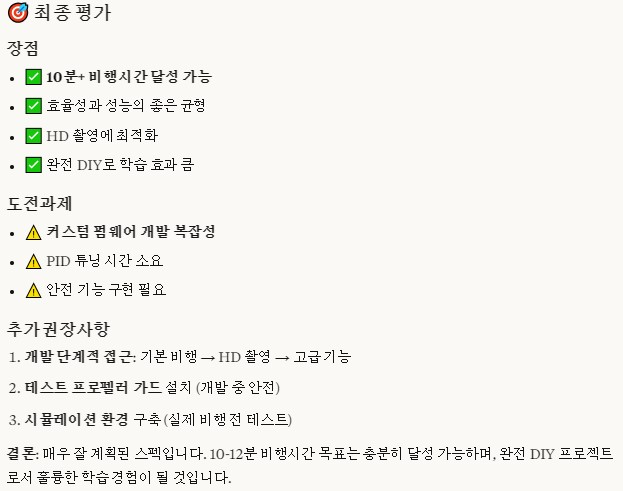

# Arduino Nano ESP32 DIY Drone (완전 DIT)
    - 완전 커스텀 펌웨어 개발
    - 비행시간: 10-12분
    - 추력/무게 비: 3.5-4.2:1 (적정)

## 1. Arduino Nano ESP32
    - 18×45mm, 약 7g
    - ESP32-C3 초소형 보드

## 2. MPU9250
    - 표준 GY-9250 모듈
    - 크기: 15×25mm (2-3g)

## 3. BetaFPV Meteor75 프레임
    ✅ 850mAh 배터리 장착 (75×19×13mm 공간 필요)
    ✅ 20×20mm 스택 ×2 (ESC + VTX)
    ✅ Arduino Nano ESP32 장착 공간
    ✅ 무게: 약 10-12g

## 4. 별도 4-in-1 ESC 구매 (20×20mm)

## 5. 모터: 1103 8000-10000KV : 4개

## 6. 배터리: BETAFPV LAVA 850mAh
    - PDB (Power Distribution Board) 또는 올인원 FC+PDB
    - 전압 레귤레이터 (5V, 3.3V)
    - 배터리 전압 모니터링 회로

## 7. 프로펠러: 50mm 3블레이드
    - $8-12 (4세트)

## 8. HD 디지털 VTX 지원: Walksnail Avatar HD V2 (20×20mm)

## 9. ND 필터: Walksnail Avatar 전용 ND 필터

## 10. 수신기
    - ExpressLRS ELRS Nano RX (초경량): 0.5g
    - FrSky XM+ (소형): 1.5g  
    - Crossfire Nano RX (장거리): 1g

## 11. 충전기

## 12. 연결 부품들
    - 커넥터류: XT30, JST-PH 등
    - 안테나: 수신기용, VTX용
    - 진동 댐퍼: 카메라/VTX용

## 13. 조종기

## 14. 고글

## 15. 개발 시 주의사항
    - ESC 통신 프로토콜 (DShot600/1200)

