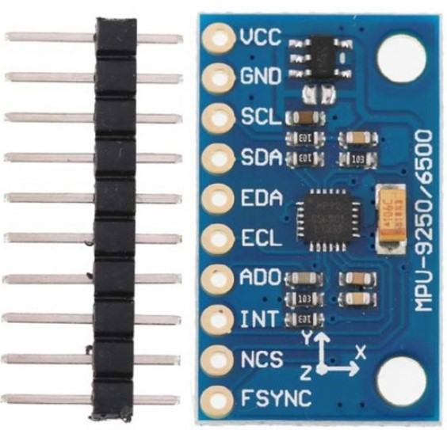

# 🎯 MPU9250 센서 통합 및 자세 추정 가이드

## 📋 목표: Arduino Nano ESP32 + MPU9250으로 정확한 자세 추정 시스템 구축

**현재 상태**: VS Code + PlatformIO 환경 완료  
**다음 목표**: MPU9250 센서 데이터 수집 및 실시간 자세 추정

---

## 🔌 Phase 1: 하드웨어 연결 및 기본 테스트 (30분)

### **1.1 MPU9250 모듈 연결**

#### **하드웨어 연결도**

작동하는 I2C 핀
```
1️⃣  I2C 설정
─────────────────────────────────────
I2C 설정: Wire.begin() - 기본 핀 사용
  Arduino Nano ESP32 기본 I2C:
    D11 (GPIO11) = SDA
    D12 (GPIO12) = SCL

2️⃣  Wire 라이브러리 초기화
─────────────────────────────────────
  호출: Wire.begin()  // 인자 없음!
[  4176][I][esp32-hal-i2c.c:75] i2cInit(): Initialising I2C Master: sda=11 scl=12 freq=100000
  ✓ Wire 초기화 성공!
  ✓ 클럭: 100kHz
  ✓ 타임아웃: 100ms
```

```
GY-9250          Arduino Nano ESP32
--------         -------------------
VCC (빨강)   →   3.3V
GND (검정)   →   GND
SCL (노랑)   →   D12 (GPIO12)
SDA (파랑)   →   D11 (GPIO11)
NCS (초록)   →   3.3V  ⚠️ 필수!!!
AD0 (흰색)   →   GND

※ GY-9250의 핀 실크가 VCC, GND, SCL, SDA, … 순인 보드가 많습니다. SCL/SDA가 바뀌지 않도록 모듈 쪽 글자를 다시 한 번 확인하세요.
※ AD0=GND면 주소 0x68, AD0=VCC면 0x69 입니다(기본 0x68).
```


### 3차
```
Arduino Nano ESP32      MPU9250 GY-9250
=======================================
VCC → 3.3V,
GND → GND,
SCL → A5, (Nano 폼팩터 기준 I2C 핀) 
SDA → A4,
AD0 → GND (주소 0x68),
NCS → 3.3V (I2C 모드 고정)
```

#### **연결 시 주의사항**
```
⚠️ 중요한 주의사항:
1. VCC는 반드시 3.3V에 연결 (5V 연결시 센서 손상!)
2. 점퍼 와이어는 10cm 이하로 짧게 (신호 품질 유지)
3. 브레드보드 연결시 확실히 삽입 (접촉 불량 방지)
4. GND 연결 필수 (모든 디지털 회로의 기준점)
5. AD0 핀을 GND에 연결하여 I2C 주소를 0x68로 설정
```



```
대부분의 GY-9250 보드에는 SDA/SCL에 4.7k~10k 풀업이 이미 실장되어 있어서 별도 풀업 저항을 추가하지 않아도 됩니다.
(보드마다 약간씩 다를 수는 있어요.)

확인하는 쉬운 방법 3가지
눈으로 확인: SDA/SCL 근처의 작은 SMD 저항에 472(4.7k) 또는 103(10k) 같은 표기가 보이면 온보드 풀업입니다. (이미지에서 SDA 옆에 103이 보인다.)
전압 측정: 보드에만 전원(가급적 3.3V)을 넣고 MCU는 연결하지 않은 채 SDA/SCL 전압을 측정 → 약 3.3V면 보드 내부로 풀업되어 있습니다.
저항 측정(전원 차단 상태): SDA(또는 SCL) ↔ VCC 사이 저항이 대략 4.7k~10kΩ이면 풀업 존재.

연결 팁 (Nano ESP32 기준)
SDA → D21(GPIO11)
SCL → D22(GPIO12)
VCC → 3.3V
GND → GND (ESP32는 3.3V 로직이므로 3.3V 공급 권장)

일단 추가 풀업 없이 연결하고 I²C 스캐너로 0x68/0x69가 보이면 그대로 사용하세요.
(불안정하면 배선 길이/속도(100kHz 권장)를 먼저 점검하고, 필요 시 4.7k 추가 검토)

주의

GY-9250은 “VCC 3~5V”라고 적힌 보드가 많지만, 일부 클론은 풀업이 VCC(레귤레이터 앞) 으로 올라가 있을 수 있습니다. 이 상태에서 5V로 공급하면 SDA/SCL에 5V가 걸려 ESP32에 무리가 갈 수 있으니 3.3V 사용이 안전합니다.
이미 온보드 풀업이 있는데 외부에 4.7k를 또 달면 병렬이 되어 등가가 낮아집니다(예: 4.7k ∥ 4.7k = 2.35k) → 전류 증가/링 형태 악화 가능. 특별한 이유 없으면 외부 풀업 추가하지 마세요.
```

### **1.2 새 프로젝트 생성**

#### **PlatformIO 프로젝트 설정**
```
1. VS Code에서 PlatformIO Home 열기
2. "New Project" 클릭
3. 설정:
   - Name: "ESP32_MPU9250_Test"
   - Board: "Arduino Nano ESP32"
   - Framework: "Arduino"
4. "Finish" 클릭 후 초기화 대기
```

#### **platformio.ini 설정**
```ini
[env:arduino_nano_esp32]
platform = espressif32
board = arduino_nano_esp32
framework = arduino

; 시리얼 설정
monitor_speed = 115200
monitor_filters = esp32_exception_decoder

; MPU9250 전용 라이브러리
lib_deps = 
    hideakitai/MPU9250@^0.4.7
    adafruit/Adafruit MPU6050@^2.2.4

; 빌드 최적화
build_flags = 
    -DCORE_DEBUG_LEVEL=3
    -DARDUINO_USB_CDC_ON_BOOT=1
```

### **1.3 I2C 연결 테스트**

#### **I2C 스캐너 코드 (src/main.cpp)**
```cpp
/*
 * MPU9250 연결 확인용 I2C 스캐너
 * VS Code + PlatformIO 환경
 */

#include <Arduino.h>
#include <Wire.h>

// I2C 핀 정의
#define I2C_SDA 4
#define I2C_SCL 5

void setup() {
    Serial.begin(115200);
    while (!Serial && millis() < 5000) delay(10);
    
    Serial.println("\n" + String("=").repeat(40));
    Serial.println("MPU9250 I2C 연결 테스트");
    Serial.println("VS Code + PlatformIO 환경");
    Serial.println("=".repeat(40));
    
    // I2C 초기화
    Wire.begin(I2C_SDA, I2C_SCL);
    Wire.setClock(400000);  // 400kHz
    
    Serial.printf("I2C 초기화 완료 - SDA: %d, SCL: %d\n", I2C_SDA, I2C_SCL);
    Serial.println("5초 후 스캔 시작...\n");
    delay(5000);
}

void loop() {
    scanI2CDevices();
    delay(10000);  // 10초마다 스캔
}

void scanI2CDevices() {
    byte error, address;
    int deviceCount = 0;
    
    Serial.println("I2C 버스 스캔 중...");
    Serial.println("주소범위: 0x01 ~ 0x7F");
    
    for (address = 1; address < 127; address++) {
        Wire.beginTransmission(address);
        error = Wire.endTransmission();
        
        if (error == 0) {
            Serial.printf("✅ 디바이스 발견: 0x%02X ", address);
            
            // 알려진 디바이스 식별
            switch (address) {
                case 0x68:
                    Serial.println("(MPU9250/MPU6050 - 자이로/가속도계)");
                    testMPU9250Communication(address);
                    break;
                case 0x0C:
                    Serial.println("(AK8963 - 자력계, MPU9250 내부)");
                    break;
                case 0x3C:
                case 0x3D:
                    Serial.println("(SSD1306 OLED 디스플레이)");
                    break;
                case 0x76:
                case 0x77:
                    Serial.println("(BMP280/BME280 - 기압센서)");
                    break;
                default:
                    Serial.println("(알 수 없는 디바이스)");
                    break;
            }
            deviceCount++;
        }
        else if (error == 4) {
            Serial.printf("❌ 알 수 없는 오류: 주소 0x%02X\n", address);
        }
    }
    
    Serial.printf("\n📊 스캔 완료: 총 %d개 디바이스 발견\n", deviceCount);
    
    if (deviceCount == 0) {
        Serial.println("\n❌ 디바이스가 발견되지 않았습니다!");
        printTroubleshooting();
    } else {
        Serial.println("✅ I2C 통신 정상");
    }
    
    Serial.println("-".repeat(40) + "\n");
}

void testMPU9250Communication(byte address) {
    // WHO_AM_I 레지스터 읽기 (0x75)
    Wire.beginTransmission(address);
    Wire.write(0x75);  // WHO_AM_I 레지스터
    Wire.endTransmission(false);
    
    Wire.requestFrom(address, (uint8_t)1);
    
    if (Wire.available()) {
        byte whoami = Wire.read();
        Serial.printf("  WHO_AM_I: 0x%02X ", whoami);
        
        if (whoami == 0x71) {
            Serial.println("(MPU9250 정상)");
        } else if (whoami == 0x68) {
            Serial.println("(MPU6050 감지됨)");
        } else {
            Serial.println("(예상과 다른 값)");
        }
    } else {
        Serial.println("  통신 오류");
    }
}

void printTroubleshooting() {
    Serial.println("🔧 문제 해결 가이드:");
    Serial.println("1. 연결 확인:");
    Serial.println("   - VCC → 3.3V (5V 아님!)");
    Serial.println("   - GND → GND");
    Serial.println("   - SDA → D4 (GPIO 4)");
    Serial.println("   - SCL → D5 (GPIO 5)");
    Serial.println("   - AD0 → GND (주소 0x68 설정)");
    Serial.println();
    Serial.println("2. 하드웨어 체크:");
    Serial.println("   - 점퍼 와이어 접촉 불량");
    Serial.println("   - 브레드보드 삽입 상태");
    Serial.println("   - MPU9250 모듈 손상 여부");
    Serial.println();
    Serial.println("3. 전원 체크:");
    Serial.println("   - 3.3V 전압 측정");
    Serial.println("   - GND 연결 확인");
}
```

#### **예상 결과**
```
정상 연결시 출력:
========================================
MPU9250 I2C 연결 테스트
VS Code + PlatformIO 환경
========================================
I2C 초기화 완료 - SDA: 4, SCL: 5
5초 후 스캔 시작...

I2C 버스 스캔 중...
주소범위: 0x01 ~ 0x7F
✅ 디바이스 발견: 0x68 (MPU9250/MPU6050 - 자이로/가속도계)
  WHO_AM_I: 0x71 (MPU9250 정상)

📊 스캔 완료: 총 1개 디바이스 발견
✅ I2C 통신 정상
```

---

## 📊 Phase 2: MPU9250 기본 데이터 읽기 (45분)

### **2.1 기본 센서 데이터 읽기**

#### **새 프로젝트 생성**
```
프로젝트명: "ESP32_MPU9250_Basic"
이전과 동일한 설정 사용
```

#### **기본 센서 읽기 코드**
```cpp
/*
 * MPU9250 기본 센서 데이터 읽기
 * 가속도계, 자이로스코프, 자력계 데이터 수집
 */

#include <Arduino.h>
#include <Wire.h>
#include <MPU9250.h>

// MPU9250 객체 생성
MPU9250 mpu;

// I2C 핀 정의  
#define I2C_SDA 4
#define I2C_SCL 5

// 센서 데이터 구조체
struct SensorData {
    // 가속도 (m/s²)
    float accel_x, accel_y, accel_z;
    // 자이로스코프 (deg/s)
    float gyro_x, gyro_y, gyro_z;
    // 자력계 (μT)
    float mag_x, mag_y, mag_z;
    // 온도 (°C)
    float temperature;
    // 타임스탬프
    unsigned long timestamp;
};

SensorData currentData;

void setup() {
    Serial.begin(115200);
    while (!Serial && millis() < 5000) delay(10);
    
    Serial.println("\n" + String("=").repeat(50));
    Serial.println("MPU9250 기본 센서 데이터 읽기");
    Serial.println("=".repeat(50));
    
    // I2C 초기화
    Wire.begin(I2C_SDA, I2C_SCL);
    Wire.setClock(400000);
    
    // MPU9250 초기화
    if (!initializeMPU9250()) {
        Serial.println("❌ MPU9250 초기화 실패!");
        Serial.println("연결을 확인하고 리셋하세요.");
        while (1) {
            delay(1000);
        }
    }
    
    Serial.println("✅ MPU9250 초기화 성공!");
    printSensorInfo();
    
    Serial.println("\n📊 실시간 센서 데이터 (1초 간격):");
    Serial.println("시간(ms)\t가속도(m/s²)\t\t자이로(deg/s)\t\t자력계(μT)\t\t온도(°C)");
    Serial.println("-".repeat(100));
}

void loop() {
    // 센서 데이터 읽기
    if (readSensorData()) {
        printSensorData();
        
        // 데이터 품질 체크
        checkDataQuality();
    } else {
        Serial.println("❌ 센서 데이터 읽기 실패");
    }
    
    delay(1000);  // 1초 간격
}

bool initializeMPU9250() {
    Serial.println("MPU9250 초기화 중...");
    
    // MPU9250 연결 확인
    if (!mpu.setup(0x68)) {
        Serial.println("MPU9250 연결 실패");
        return false;
    }
    
    delay(1000);  // 안정화 대기
    
    // 캘리브레이션 (선택사항)
    Serial.println("자이로스코프 캘리브레이션 중... (움직이지 마세요!)");
    mpu.calibrateAccelGyro();
    
    Serial.println("자력계 캘리브레이션 중... (8자 모양으로 회전시키세요!)");
    Serial.println("10초 후 자동 시작...");
    delay(10000);
    
    mpu.calibrateMag();
    
    return true;
}

bool readSensorData() {
    if (!mpu.update()) {
        return false;
    }
    
    currentData.timestamp = millis();
    
    // 가속도 데이터 (g → m/s² 변환)
    currentData.accel_x = mpu.getAccX() * 9.81f;
    currentData.accel_y = mpu.getAccY() * 9.81f;
    currentData.accel_z = mpu.getAccZ() * 9.81f;
    
    // 자이로스코프 데이터 (deg/s)
    currentData.gyro_x = mpu.getGyroX();
    currentData.gyro_y = mpu.getGyroY();
    currentData.gyro_z = mpu.getGyroZ();
    
    // 자력계 데이터 (μT)
    currentData.mag_x = mpu.getMagX();
    currentData.mag_y = mpu.getMagY();
    currentData.mag_z = mpu.getMagZ();
    
    // 온도 데이터
    currentData.temperature = mpu.getTemperature();
    
    return true;
}

void printSensorData() {
    Serial.printf("%lu\t", currentData.timestamp);
    
    // 가속도 (소수점 2자리)
    Serial.printf("%.2f,%.2f,%.2f\t", 
                 currentData.accel_x, 
                 currentData.accel_y, 
                 currentData.accel_z);
    
    // 자이로스코프 (소수점 1자리)
    Serial.printf("%.1f,%.1f,%.1f\t", 
                 currentData.gyro_x, 
                 currentData.gyro_y, 
                 currentData.gyro_z);
    
    // 자력계 (소수점 1자리)
    Serial.printf("%.1f,%.1f,%.1f\t", 
                 currentData.mag_x, 
                 currentData.mag_y, 
                 currentData.mag_z);
    
    // 온도 (소수점 1자리)
    Serial.printf("%.1f\n", currentData.temperature);
}

void printSensorInfo() {
    Serial.println("\n📋 센서 정보:");
    Serial.println("가속도계:");
    Serial.printf("  - 범위: ±%dg\n", 8);  // 일반적으로 ±8g 설정
    Serial.printf("  - 해상도: %.3f mg/LSB\n", 8000.0/32768.0);
    
    Serial.println("자이로스코프:");
    Serial.printf("  - 범위: ±%d°/s\n", 1000);  // 일반적으로 ±1000°/s 설정
    Serial.printf("  - 해상도: %.3f °/s/LSB\n", 2000.0/32768.0);
    
    Serial.println("자력계:");
    Serial.println("  - 범위: ±4800μT");
    Serial.println("  - 해상도: 0.6μT/LSB");
    
    Serial.println("온도센서:");
    Serial.println("  - 범위: -40°C ~ +85°C");
    Serial.println("  - 정확도: ±1°C");
}

void checkDataQuality() {
    static int errorCount = 0;
    bool dataOK = true;
    
    // 가속도 데이터 체크 (±50m/s² 범위)
    if (abs(currentData.accel_x) > 50 || 
        abs(currentData.accel_y) > 50 || 
        abs(currentData.accel_z) > 50) {
        Serial.println("⚠️  가속도 데이터 이상");
        dataOK = false;
    }
    
    // 자이로스코프 데이터 체크 (±2000°/s 범위)
    if (abs(currentData.gyro_x) > 2000 || 
        abs(currentData.gyro_y) > 2000 || 
        abs(currentData.gyro_z) > 2000) {
        Serial.println("⚠️  자이로스코프 데이터 이상");
        dataOK = false;
    }
    
    // 자력계 데이터 체크 (0이면 문제)
    if (currentData.mag_x == 0 && 
        currentData.mag_y == 0 && 
        currentData.mag_z == 0) {
        Serial.println("⚠️  자력계 데이터 없음");
        dataOK = false;
    }
    
    // 에러 카운팅
    if (!dataOK) {
        errorCount++;
        if (errorCount > 5) {
            Serial.println("❌ 연속 에러 발생 - 센서 연결 확인 필요");
            errorCount = 0;
        }
    } else {
        errorCount = 0;
    }
}
```

### **2.2 실시간 데이터 모니터링 시스템**

#### **웹 기반 모니터링 코드**
```cpp
/*
 * MPU9250 실시간 웹 모니터링 시스템
 * WiFi + WebSocket을 통한 실시간 데이터 전송
 */

#include <Arduino.h>
#include <WiFi.h>
#include <AsyncTCP.h>
#include <ESPAsyncWebServer.h>
#include <ArduinoJson.h>
#include <MPU9250.h>

// WiFi 설정
const char* ssid = "ESP32_MPU9250";
const char* password = "sensor123";

// 서버 객체
AsyncWebServer server(80);
AsyncWebSocket ws("/ws");

// MPU9250 객체
MPU9250 mpu;

// 센서 데이터
struct RealTimeData {
    float roll, pitch, yaw;
    float accel_x, accel_y, accel_z;
    float gyro_x, gyro_y, gyro_z;
    float mag_x, mag_y, mag_z;
    float temperature;
    unsigned long timestamp;
};

RealTimeData realtimeData;

void setup() {
    Serial.begin(115200);
    
    // MPU9250 초기화
    Wire.begin(4, 5);
    if (!mpu.setup(0x68)) {
        Serial.println("MPU9250 초기화 실패!");
        return;
    }
    
    // WiFi AP 모드 시작
    WiFi.softAP(ssid, password);
    IPAddress IP = WiFi.softAPIP();
    Serial.printf("WiFi AP 시작 - IP: %s\n", IP.toString().c_str());
    
    // 웹 서버 설정
    setupWebServer();
    
    Serial.println("웹 브라우저에서 접속하세요:");
    Serial.printf("http://%s\n", IP.toString().c_str());
}

void loop() {
    // 센서 데이터 업데이트
    if (mpu.update()) {
        updateSensorData();
        
        // 웹소켓으로 데이터 전송 (100Hz)
        static unsigned long lastSend = 0;
        if (millis() - lastSend >= 10) {
            sendWebSocketData();
            lastSend = millis();
        }
    }
    
    delay(1);
}

void updateSensorData() {
    realtimeData.timestamp = millis();
    
    // 가속도 데이터
    realtimeData.accel_x = mpu.getAccX();
    realtimeData.accel_y = mpu.getAccY();
    realtimeData.accel_z = mpu.getAccZ();
    
    // 자이로 데이터
    realtimeData.gyro_x = mpu.getGyroX();
    realtimeData.gyro_y = mpu.getGyroY();
    realtimeData.gyro_z = mpu.getGyroZ();
    
    // 자력계 데이터
    realtimeData.mag_x = mpu.getMagX();
    realtimeData.mag_y = mpu.getMagY();
    realtimeData.mag_z = mpu.getMagZ();
    
    // 온도
    realtimeData.temperature = mpu.getTemperature();
    
    // 자세 각도 계산 (간단한 방법)
    realtimeData.roll = mpu.getRoll();
    realtimeData.pitch = mpu.getPitch();
    realtimeData.yaw = mpu.getYaw();
}

void sendWebSocketData() {
    StaticJsonDocument<512> doc;
    
    doc["timestamp"] = realtimeData.timestamp;
    doc["accel"]["x"] = realtimeData.accel_x;
    doc["accel"]["y"] = realtimeData.accel_y;
    doc["accel"]["z"] = realtimeData.accel_z;
    doc["gyro"]["x"] = realtimeData.gyro_x;
    doc["gyro"]["y"] = realtimeData.gyro_y;
    doc["gyro"]["z"] = realtimeData.gyro_z;
    doc["mag"]["x"] = realtimeData.mag_x;
    doc["mag"]["y"] = realtimeData.mag_y;
    doc["mag"]["z"] = realtimeData.mag_z;
    doc["attitude"]["roll"] = realtimeData.roll;
    doc["attitude"]["pitch"] = realtimeData.pitch;
    doc["attitude"]["yaw"] = realtimeData.yaw;
    doc["temperature"] = realtimeData.temperature;
    
    String jsonString;
    serializeJson(doc, jsonString);
    
    ws.textAll(jsonString);
}

void setupWebServer() {
    // 웹소켓 이벤트 핸들러
    ws.onEvent([](AsyncWebSocket *server, AsyncWebSocketClient *client, 
                  AwsEventType type, void *arg, uint8_t *data, size_t len) {
        if (type == WS_EVT_CONNECT) {
            Serial.printf("웹소켓 클라이언트 연결: %u\n", client->id());
        } else if (type == WS_EVT_DISCONNECT) {
            Serial.printf("웹소켓 클라이언트 해제: %u\n", client->id());
        }
    });
    
    server.addHandler(&ws);
    
    // HTML 페이지 제공
    server.on("/", HTTP_GET, [](AsyncWebServerRequest *request) {
        request->send_P(200, "text/html", htmlPage);
    });
    
    server.begin();
    Serial.println("웹 서버 시작 완료");
}

// HTML 페이지 (간단한 실시간 모니터링)
const char htmlPage[] PROGMEM = R"rawliteral(
<!DOCTYPE html>
<html>
<head>
    <title>MPU9250 실시간 모니터</title>
    <style>
        body { font-family: Arial, sans-serif; margin: 20px; }
        .container { display: flex; flex-wrap: wrap; gap: 20px; }
        .sensor-box { 
            border: 1px solid #ccc; 
            padding: 15px; 
            border-radius: 8px;
            min-width: 200px;
        }
        .value { font-size: 1.2em; font-weight: bold; color: #2196F3; }
        .timestamp { font-size: 0.9em; color: #666; }
        #status { margin-bottom: 20px; }
        .connected { color: green; }
        .disconnected { color: red; }
    </style>
</head>
<body>
    <h1>MPU9250 실시간 센서 모니터</h1>
    
    <div id="status" class="disconnected">연결 중...</div>
    
    <div class="container">
        <div class="sensor-box">
            <h3>자세 (도)</h3>
            <div>Roll: <span id="roll" class="value">0.0</span>°</div>
            <div>Pitch: <span id="pitch" class="value">0.0</span>°</div>
            <div>Yaw: <span id="yaw" class="value">0.0</span>°</div>
        </div>
        
        <div class="sensor-box">
            <h3>가속도 (g)</h3>
            <div>X: <span id="acc_x" class="value">0.0</span></div>
            <div>Y: <span id="acc_y" class="value">0.0</span></div>
            <div>Z: <span id="acc_z" class="value">0.0</span></div>
        </div>
        
        <div class="sensor-box">
            <h3>자이로 (°/s)</h3>
            <div>X: <span id="gyro_x" class="value">0.0</span></div>
            <div>Y: <span id="gyro_y" class="value">0.0</span></div>
            <div>Z: <span id="gyro_z" class="value">0.0</span></div>
        </div>
        
        <div class="sensor-box">
            <h3>자력계 (μT)</h3>
            <div>X: <span id="mag_x" class="value">0.0</span></div>
            <div>Y: <span id="mag_y" class="value">0.0</span></div>
            <div>Z: <span id="mag_z" class="value">0.0</span></div>
        </div>
        
        <div class="sensor-box">
            <h3>기타</h3>
            <div>온도: <span id="temp" class="value">0.0</span>°C</div>
            <div class="timestamp">시간: <span id="timestamp">0</span>ms</div>
        </div>
    </div>

    <script>
        const ws = new WebSocket('ws://' + window.location.host + '/ws');
        const status = document.getElementById('status');
        
        ws.onopen = function() {
            status.textContent = '✅ 연결됨';
            status.className = 'connected';
        };
        
        ws.onclose = function() {
            status.textContent = '❌ 연결 끊어짐';
            status.className = 'disconnected';
        };
        
        ws.onmessage = function(event) {
            const data = JSON.parse(event.data);
            
            // 자세 데이터 업데이트
            document.getElementById('roll').textContent = data.attitude.roll.toFixed(1);
            document.getElementById('pitch').textContent = data.attitude.pitch.toFixed(1);
            document.getElementById('yaw').textContent = data.attitude.yaw.toFixed(1);
            
            // 가속도 데이터 업데이트
            document.getElementById('acc_x').textContent = data.accel.x.toFixed(2);
            document.getElementById('acc_y').textContent = data.accel.y.toFixed(2);
            document.getElementById('acc_z').textContent = data.accel.z.toFixed(2);
            
            // 자이로 데이터 업데이트
            document.getElementById('gyro_x').textContent = data.gyro.x.toFixed(1);
            document.getElementById('gyro_y').textContent = data.gyro.y.toFixed(1);
            document.getElementById('gyro_z').textContent = data.gyro.z.toFixed(1);
            
            // 자력계 데이터 업데이트
            document.getElementById('mag_x').textContent = data.mag.x.toFixed(1);
            document.getElementById('mag_y').textContent = data.mag.y.toFixed(1);
            document.getElementById('mag_z').textContent = data.mag.z.toFixed(1);
            
            // 기타 데이터 업데이트
            document.getElementById('temp').textContent = data.temperature.toFixed(1);
            document.getElementById('timestamp').textContent = data.timestamp;
        };
    </script>
</body>
</html>
)rawliteral";
```

---

## 🧮 Phase 3: 고급 자세 추정 알고리즘 (90분)

### **3.1 상보 필터 구현**

#### **새 프로젝트: "ESP32_AttitudeEstimation"**

```cpp
/*
 * 고급 자세 추정 시스템
 * 상보 필터 + 칼만 필터 구현
 */

#include <Arduino.h>
#include <MPU9250.h>
#include <math.h>

// MPU9250 객체
MPU9250 mpu;

// 자세 추정 클래스
class AttitudeEstimator {
private:
    // 상보 필터 계수 (0.98 = 자이로 98%, 가속도 2%)
    const float alpha = 0.98f;
    
    // 현재 자세 각도 (라디안)
    float roll = 0.0f;
    float pitch = 0.0f;
    float yaw = 0.0f;
    
    // 이전 시간
    unsigned long lastUpdate = 0;
    
    // 저역 통과 필터 클래스
    class LowPassFilter {
    private:
        float output = 0.0f;
        float alpha;
        
    public:
        LowPassFilter(float cutoffFreq, float sampleRate) {
            float RC = 1.0f / (2.0f * PI * cutoffFreq);
            float dt = 1.0f / sampleRate;
            alpha = dt / (dt + RC);
        }
        
        float update(float input) {
            output = alpha * input + (1.0f - alpha) * output;
            return output;
        }
        
        void reset() { output = 0.0f; }
    };
    
    // 각 축별 필터
    LowPassFilter accelFilterX, accelFilterY, accelFilterZ;
    LowPassFilter gyroFilterX, gyroFilterY, gyroFilterZ;
    
public:
    AttitudeEstimator() : 
        accelFilterX(20.0f, 1000.0f),  // 20Hz 컷오프, 1kHz 샘플링
        accelFilterY(20.0f, 1000.0f),
        accelFilterZ(20.0f, 1000.0f),
        gyroFilterX(50.0f, 1000.0f),   // 50Hz 컷오프
        gyroFilterY(50.0f, 1000.0f),
        gyroFilterZ(50.0f, 1000.0f) {}
    
    void update(float ax, float ay, float az, 
                float gx, float gy, float gz,
                float mx, float my, float mz) {
        
        unsigned long now = micros();
        float dt = (now - lastUpdate) / 1000000.0f;  // 초 단위
        lastUpdate = now;
        
        if (dt > 0.1f) dt = 0.001f;  // 초기값 또는 비정상적인 dt 방지
        
        // 센서 데이터 필터링
        ax = accelFilterX.update(ax);
        ay = accelFilterY.update(ay);
        az = accelFilterZ.update(az);
        
        gx = gyroFilterX.update(gx);
        gy = gyroFilterY.update(gy);
        gz = gyroFilterZ.update(gz);
        
        // 자이로스코프 데이터를 라디안으로 변환
        gx *= DEG_TO_RAD;
        gy *= DEG_TO_RAD;
        gz *= DEG_TO_RAD;
        
        // 자이로스코프로부터 각도 예측
        float gyroRoll = roll + gx * dt;
        float gyroPitch = pitch + gy * dt;
        float gyroYaw = yaw + gz * dt;
        
        // 가속도계로부터 롤/피치 계산
        float accelRoll = atan2(ay, az);
        float accelPitch = atan2(-ax, sqrt(ay*ay + az*az));
        
        // 상보 필터 적용
        roll = alpha * gyroRoll + (1.0f - alpha) * accelRoll;
        pitch = alpha * gyroPitch + (1.0f - alpha) * accelPitch;
        
        // 자력계를 이용한 요 각도 계산
        if (mx != 0 || my != 0) {  // 자력계 데이터가 유효한 경우
            // 자력계 데이터를 수평면에 투영
            float magX = mx * cos(pitch) + mz * sin(pitch);
            float magY = mx * sin(roll) * sin(pitch) + my * cos(roll) - mz * sin(roll) * cos(pitch);
            
            float magYaw = atan2(-magY, magX);
            
            // 요 각도에 상보 필터 적용 (자력계 가중치 낮춤)
            yaw = 0.95f * gyroYaw + 0.05f * magYaw;
        } else {
            yaw = gyroYaw;  // 자력계 없이는 자이로스코프만 사용
        }
        
        // 각도 범위 정규화 (-π ~ π)
        roll = normalizeAngle(roll);
        pitch = normalizeAngle(pitch);
        yaw = normalizeAngle(yaw);
    }
    
    float getRoll() const { return roll * RAD_TO_DEG; }
    float getPitch() const { return pitch * RAD_TO_DEG; }
    float getYaw() const { return yaw * RAD_TO_DEG; }
    
    void reset() {
        roll = pitch = yaw = 0.0f;
        lastUpdate = micros();
        
        accelFilterX.reset();
        accelFilterY.reset();
        accelFilterZ.reset();
        gyroFilterX.reset();
        gyroFilterY.reset();
        gyroFilterZ.reset();
    }
    
private:
    float normalizeAngle(float angle) {
        while (angle > PI) angle -= 2.0f * PI;
        while (angle < -PI) angle += 2.0f * PI;
        return angle;
    }
};

// 전역 객체
AttitudeEstimator attitude;

// 성능 모니터링
struct PerformanceStats {
    unsigned long loopCount = 0;
    unsigned long maxLoopTime = 0;
    unsigned long totalLoopTime = 0;
    unsigned long lastReport = 0;
};

PerformanceStats perfStats;

void setup() {
    Serial.begin(115200);
    while (!Serial && millis() < 5000) delay(10);
    
    Serial.println("\n" + String("=").repeat(60));
    Serial.println("고급 자세 추정 시스템 - 상보 필터 구현");
    Serial.println("=".repeat(60));
    
    // MPU9250 초기화
    Wire.begin(4, 5);
    Wire.setClock(400000);
    
    if (!mpu.setup(0x68)) {
        Serial.println("❌ MPU9250 초기화 실패!");
        while (1) delay(1000);
    }
    
    Serial.println("✅ MPU9250 초기화 성공");
    
    // 캘리브레이션
    Serial.println("📊 자이로스코프 캘리브레이션 중... (정지 상태 유지!)");
    delay(2000);
    mpu.calibrateAccelGyro();
    
    Serial.println("📊 자력계 캘리브레이션 중... (8자 모양으로 회전!)");
    Serial.println("5초 후 시작...");
    delay(5000);
    mpu.calibrateMag();
    
    Serial.println("✅ 캘리브레이션 완료");
    
    // 자세 추정기 초기화
    attitude.reset();
    
    Serial.println("\n📊 실시간 자세 추정 시작 (1000Hz 목표)");
    Serial.println("시간(ms)\tRoll(°)\tPitch(°)\tYaw(°)\t루프시간(μs)");
    Serial.println("-".repeat(70));
    
    perfStats.lastReport = millis();
}

void loop() {
    unsigned long loopStart = micros();
    
    // MPU9250 데이터 읽기
    if (mpu.update()) {
        // 센서 데이터 가져오기
        float ax = mpu.getAccX();
        float ay = mpu.getAccY();
        float az = mpu.getAccZ();
        
        float gx = mpu.getGyroX();
        float gy = mpu.getGyroY();
        float gz = mpu.getGyroZ();
        
        float mx = mpu.getMagX();
        float my = mpu.getMagY();
        float mz = mpu.getMagZ();
        
        // 자세 추정 업데이트
        attitude.update(ax, ay, az, gx, gy, gz, mx, my, mz);
        
        // 결과 출력 (100Hz로 제한)
        static unsigned long lastPrint = 0;
        if (micros() - lastPrint >= 10000) {  // 10ms = 100Hz
            lastPrint = micros();
            
            Serial.printf("%lu\t\t%.1f\t%.1f\t%.1f\t%lu\n",
                         millis(),
                         attitude.getRoll(),
                         attitude.getPitch(), 
                         attitude.getYaw(),
                         micros() - loopStart);
        }
    }
    
    // 성능 통계 업데이트
    updatePerformanceStats(micros() - loopStart);
    
    // 1000Hz 목표 (1ms 주기)
    delayMicroseconds(100);  // 최소 지연
}

void updatePerformanceStats(unsigned long loopTime) {
    perfStats.loopCount++;
    perfStats.totalLoopTime += loopTime;
    
    if (loopTime > perfStats.maxLoopTime) {
        perfStats.maxLoopTime = loopTime;
    }
    
    // 5초마다 성능 리포트
    if (millis() - perfStats.lastReport >= 5000) {
        printPerformanceReport();
        perfStats.lastReport = millis();
        
        // 통계 리셋
        perfStats.loopCount = 0;
        perfStats.totalLoopTime = 0;
        perfStats.maxLoopTime = 0;
    }
}

void printPerformanceReport() {
    if (perfStats.loopCount > 0) {
        float avgLoopTime = (float)perfStats.totalLoopTime / perfStats.loopCount;
        float actualFreq = 1000000.0f / avgLoopTime;
        
        Serial.println("\n" + String("=").repeat(50));
        Serial.println("📊 성능 리포트 (최근 5초)");
        Serial.println("=".repeat(50));
        Serial.printf("평균 루프 시간: %.1f μs\n", avgLoopTime);
        Serial.printf("최대 루프 시간: %lu μs\n", perfStats.maxLoopTime);
        Serial.printf("실제 주파수: %.0f Hz\n", actualFreq);
        Serial.printf("총 루프 수: %lu\n", perfStats.loopCount);
        Serial.printf("현재 메모리: %d bytes\n", ESP.getFreeHeap());
        
        if (actualFreq < 500) {
            Serial.println("⚠️  목표 주파수 미달 - 코드 최적화 필요");
        } else if (actualFreq >= 1000) {
            Serial.println("✅ 목표 성능 달성!");
        }
        
        Serial.println("=".repeat(50) + "\n");
    }
}
```

### **3.2 칼만 필터 구현 (고급)**

#### **확장 칼만 필터 클래스**
```cpp
/*
 * 확장 칼만 필터를 이용한 고정밀 자세 추정
 * 더 정확하지만 계산량이 많음
 */

class ExtendedKalmanFilter {
private:
    // 상태 벡터: [roll, pitch, yaw, gyro_bias_x, gyro_bias_y, gyro_bias_z]
    static const int STATE_SIZE = 6;
    static const int MEASUREMENT_SIZE = 6;
    
    // 상태 벡터
    float state[STATE_SIZE] = {0};
    
    // 공분산 행렬 P (6x6)
    float P[STATE_SIZE][STATE_SIZE] = {0};
    
    // 프로세스 노이즈 Q
    float Q[STATE_SIZE][STATE_SIZE] = {0};
    
    // 측정 노이즈 R
    float R[MEASUREMENT_SIZE][MEASUREMENT_SIZE] = {0};
    
    // 시간 간격
    float dt = 0.001f;
    
public:
    ExtendedKalmanFilter() {
        initializeMatrices();
    }
    
    void initializeMatrices() {
        // 초기 공분산 행렬 (대각선 요소만)
        for (int i = 0; i < STATE_SIZE; i++) {
            for (int j = 0; j < STATE_SIZE; j++) {
                P[i][j] = (i == j) ? 1.0f : 0.0f;
            }
        }
        
        // 프로세스 노이즈 (자이로 노이즈 + 바이어스 드리프트)
        Q[0][0] = 0.01f;  // roll 노이즈
        Q[1][1] = 0.01f;  // pitch 노이즈
        Q[2][2] = 0.01f;  // yaw 노이즈
        Q[3][3] = 0.001f; // gyro bias x
        Q[4][4] = 0.001f; // gyro bias y
        Q[5][5] = 0.001f; // gyro bias z
        
        // 측정 노이즈 (가속도계 + 자력계)
        R[0][0] = 0.1f;   // accel x
        R[1][1] = 0.1f;   // accel y
        R[2][2] = 0.1f;   // accel z
        R[3][3] = 0.5f;   // mag x
        R[4][4] = 0.5f;   // mag y
        R[5][5] = 0.5f;   // mag z
    }
    
    void predict(float gx, float gy, float gz, float deltaTime) {
        dt = deltaTime;
        
        // 자이로 바이어스 보정
        float corrected_gx = gx - state[3];
        float corrected_gy = gy - state[4];
        float corrected_gz = gz - state[5];
        
        // 상태 예측 (오일러 적분)
        state[0] += corrected_gx * dt;  // roll
        state[1] += corrected_gy * dt;  // pitch
        state[2] += corrected_gz * dt;  // yaw
        // 바이어스는 변화 없음 (state[3], state[4], state[5])
        
        // 각도 정규화
        state[0] = normalizeAngle(state[0]);
        state[1] = normalizeAngle(state[1]);
        state[2] = normalizeAngle(state[2]);
        
        // 공분산 예측 (간단화된 버전)
        for (int i = 0; i < 3; i++) {
            P[i][i] += Q[i][i] * dt * dt;
        }
        for (int i = 3; i < 6; i++) {
            P[i][i] += Q[i][i] * dt;
        }
    }
    
    void update(float ax, float ay, float az, float mx, float my, float mz) {
        // 측정값으로부터 예상되는 자세 계산
        float measured_roll = atan2(ay, az);
        float measured_pitch = atan2(-ax, sqrt(ay*ay + az*az));
        
        // 자력계로부터 요 각도 (간단화)
        float measured_yaw = atan2(-my, mx);
        
        // 혁신 (innovation) 계산
        float innovation[6];
        innovation[0] = ax;  // 가속도 측정값 그대로 사용
        innovation[1] = ay;
        innovation[2] = az;
        innovation[3] = mx;  // 자력계 측정값
        innovation[4] = my;
        innovation[5] = mz;
        
        // 칼만 게인 계산 (간단화된 버전)
        float K[STATE_SIZE][MEASUREMENT_SIZE];
        for (int i = 0; i < STATE_SIZE; i++) {
            for (int j = 0; j < MEASUREMENT_SIZE; j++) {
                if (i == j && i < 3) {
                    K[i][j] = P[i][i] / (P[i][i] + R[j][j]);
                } else {
                    K[i][j] = 0.0f;
                }
            }
        }
        
        // 상태 업데이트 (간단화)
        state[0] += K[0][0] * (measured_roll - state[0]);
        state[1] += K[1][1] * (measured_pitch - state[1]);
        
        // 공분산 업데이트
        for (int i = 0; i < 3; i++) {
            P[i][i] = (1.0f - K[i][i]) * P[i][i];
        }
    }
    
    float getRoll() const { return state[0] * RAD_TO_DEG; }
    float getPitch() const { return state[1] * RAD_TO_DEG; }
    float getYaw() const { return state[2] * RAD_TO_DEG; }
    
    void getRollPitchYaw(float& roll, float& pitch, float& yaw) const {
        roll = state[0] * RAD_TO_DEG;
        pitch = state[1] * RAD_TO_DEG;
        yaw = state[2] * RAD_TO_DEG;
    }
    
    void getGyroBias(float& bias_x, float& bias_y, float& bias_z) const {
        bias_x = state[3] * RAD_TO_DEG;
        bias_y = state[4] * RAD_TO_DEG;
        bias_z = state[5] * RAD_TO_DEG;
    }
    
private:
    float normalizeAngle(float angle) {
        while (angle > PI) angle -= 2.0f * PI;
        while (angle < -PI) angle += 2.0f * PI;
        return angle;
    }
};
```

### **3.3 센서 융합 시스템 통합**

#### **다중 필터 비교 시스템**
```cpp
/*
 * 상보 필터 vs 칼만 필터 비교 시스템
 * 실시간으로 두 필터의 성능을 비교
 */

#include <Arduino.h>
#include <MPU9250.h>

MPU9250 mpu;
AttitudeEstimator complementaryFilter;
ExtendedKalmanFilter kalmanFilter;

struct FilterComparison {
    float comp_roll, comp_pitch, comp_yaw;
    float kf_roll, kf_pitch, kf_yaw;
    float raw_roll, raw_pitch, raw_yaw;
    unsigned long timestamp;
};

FilterComparison comparison;

void setup() {
    Serial.begin(115200);
    
    // MPU9250 초기화
    Wire.begin(4, 5);
    if (!mpu.setup(0x68)) {
        Serial.println("MPU9250 초기화 실패!");
        return;
    }
    
    // 캘리브레이션
    Serial.println("캘리브레이션 중...");
    mpu.calibrateAccelGyro();
    mpu.calibrateMag();
    
    // 필터 초기화
    complementaryFilter.reset();
    
    Serial.println("\n필터 비교 시스템 시작");
    Serial.println("시간(ms)\t상보필터(°)\t\t칼만필터(°)\t\t원시데이터(°)");
    Serial.println("\t\tR\tP\tY\tR\tP\tY\tR\tP\tY");
    Serial.println("-".repeat(80));
}

void loop() {
    if (mpu.update()) {
        // 센서 데이터 가져오기
        float ax = mpu.getAccX();
        float ay = mpu.getAccY();
        float az = mpu.getAccZ();
        float gx = mpu.getGyroX();
        float gy = mpu.getGyroY();
        float gz = mpu.getGyroZ();
        float mx = mpu.getMagX();
        float my = mpu.getMagY();
        float mz = mpu.getMagZ();
        
        // 원시 각도 계산 (가속도계만 사용)
        comparison.raw_roll = atan2(ay, az) * RAD_TO_DEG;
        comparison.raw_pitch = atan2(-ax, sqrt(ay*ay + az*az)) * RAD_TO_DEG;
        comparison.raw_yaw = atan2(-my, mx) * RAD_TO_DEG;
        
        // 상보 필터 업데이트
        complementaryFilter.update(ax, ay, az, gx, gy, gz, mx, my, mz);
        comparison.comp_roll = complementaryFilter.getRoll();
        comparison.comp_pitch = complementaryFilter.getPitch();
        comparison.comp_yaw = complementaryFilter.getYaw();
        
        // 칼만 필터 업데이트
        static unsigned long lastTime = micros();
        unsigned long now = micros();
        float dt = (now - lastTime) / 1000000.0f;
        lastTime = now;
        
        kalmanFilter.predict(gx * DEG_TO_RAD, gy * DEG_TO_RAD, gz * DEG_TO_RAD, dt);
        kalmanFilter.update(ax, ay, az, mx, my, mz);
        comparison.kf_roll = kalmanFilter.getRoll();
        comparison.kf_pitch = kalmanFilter.getPitch();
        comparison.kf_yaw = kalmanFilter.getYaw();
        
        comparison.timestamp = millis();
        
        // 결과 출력 (10Hz)
        static unsigned long lastPrint = 0;
        if (millis() - lastPrint >= 100) {
            printComparison();
            lastPrint = millis();
        }
    }
    
    delayMicroseconds(500);  // 2000Hz 샘플링
}

void printComparison() {
    Serial.printf("%lu\t", comparison.timestamp);
    
    // 상보 필터
    Serial.printf("%.1f\t%.1f\t%.1f\t", 
                 comparison.comp_roll, 
                 comparison.comp_pitch, 
                 comparison.comp_yaw);
    
    // 칼만 필터  
    Serial.printf("%.1f\t%.1f\t%.1f\t", 
                 comparison.kf_roll, 
                 comparison.kf_pitch, 
                 comparison.kf_yaw);
    
    // 원시 데이터
    Serial.printf("%.1f\t%.1f\t%.1f\n", 
                 comparison.raw_roll, 
                 comparison.raw_pitch, 
                 comparison.raw_yaw);
}
```

---

🎯 4.1 고급 캘리브레이션 시스템
4.1.1 완전 자동 캘리브레이션 도구
새 프로젝트: "ESP32_Advanced_Calibration"

platformio.ini 설정:
```
[env:arduino_nano_esp32_calib]
platform = espressif32
board = arduino_nano_esp32
framework = arduino

monitor_speed = 115200
monitor_filters = esp32_exception_decoder

lib_deps = 
    hideakitai/MPU9250@^0.4.7
    bblanchon/ArduinoJson@^6.21.3
    esphome/AsyncTCP-esphome@^2.0.1
    lacamera/ESPAsyncWebServer@^2.2.1

build_flags = 
    -DCORE_DEBUG_LEVEL=3
    -DARDUINO_USB_CDC_ON_BOOT=1
```

고급 캘리브레이션 메인 코드
cpp
/*
 * ESP32 MPU9250 고급 캘리브레이션 시스템 - 완성 코드
 * 웹 기반 GUI + 자동 캘리브레이션 + EEPROM 저장
 */

#include <Arduino.h>
#include <WiFi.h>
#include <AsyncTCP.h>
#include <ESPAsyncWebServer.h>
#include <ArduinoJson.h>
#include <MPU9250.h>
#include <EEPROM.h>
#include <math.h>

// 하드웨어 설정
#define I2C_SDA 4
#define I2C_SCL 5
#define LED_PIN 2
#define BUZZER_PIN 13

// EEPROM 설정
#define EEPROM_SIZE 512
#define CALIB_MAGIC 0xCAFEBABE
#define CALIB_ADDR 0

// WiFi 설정
const char* ssid = "ESP32_Calibration";
const char* password = "calib2024";

// 객체 초기화
MPU9250 mpu;
AsyncWebServer server(80);
AsyncWebSocket ws("/ws");

// 캘리브레이션 데이터 구조체 (문서에서 정의된 것과 동일)
struct CalibrationData {
    uint32_t magic = CALIB_MAGIC;
    
    struct {
        float offset[3] = {0, 0, 0};
        float scale[3] = {1, 1, 1};
        bool completed = false;
        float quality = 0.0f;
    } accel;
    
    struct {
        float offset[3] = {0, 0, 0};
        float noise[3] = {0, 0, 0};
        bool completed = false;
        float quality = 0.0f;
    } gyro;
    
    struct {
        float offset[3] = {0, 0, 0};
        float scale[3] = {1, 1, 1};
        float rotation[9] = {1,0,0, 0,1,0, 0,0,1};
        bool completed = false;
        float quality = 0.0f;
    } mag;
    
    float overallQuality = 0.0f;
    unsigned long timestamp = 0;
};

CalibrationData calibData;

// 캘리브레이션 상태 관리
enum CalibState {
    CALIB_IDLE,
    CALIB_ACCEL_RUNNING,
    CALIB_GYRO_RUNNING,
    CALIB_MAG_RUNNING,
    CALIB_COMPLETE,
    CALIB_ERROR
};

struct CalibrationStatus {
    CalibState state = CALIB_IDLE;
    int progress = 0;
    String message = "대기 중";
    String instruction = "";
    bool userAction = false;
    unsigned long startTime = 0;
    int currentStep = 0;
    int totalSteps = 0;
};

CalibrationStatus calibStatus;

// 함수 선언
void loadCalibrationData();
void saveCalibrationData();
void blinkError();
void playStartupTone();
void playSuccessTone();
void updateStatusLED();
void sendSensorData();
void sendCalibrationStatus();
void onWebSocketEvent(AsyncWebSocket *server, AsyncWebSocketClient *client, AwsEventType type, void *arg, uint8_t *data, size_t len);
void setupWebServer();
const char* getCalibrationHTML();

// API 핸들러 선언
void handleStartAccelCalib(AsyncWebServerRequest *request);
void handleStartGyroCalib(AsyncWebServerRequest *request);
void handleStartMagCalib(AsyncWebServerRequest *request);
void handleStopCalib(AsyncWebServerRequest *request);
void handleSaveCalib(AsyncWebServerRequest *request);
void handleLoadCalib(AsyncWebServerRequest *request);
void handleResetCalib(AsyncWebServerRequest *request);
void handleGetStatus(AsyncWebServerRequest *request);

void setup() {
    Serial.begin(115200);
    while (!Serial && millis() < 5000) delay(10);
    
    Serial.println("\n========================================");
    Serial.println("🔧 ESP32 MPU9250 고급 캘리브레이션 시스템");
    Serial.println("========================================");
    
    // GPIO 초기화
    pinMode(LED_PIN, OUTPUT);
    pinMode(BUZZER_PIN, OUTPUT);
    
    // EEPROM 초기화
    EEPROM.begin(EEPROM_SIZE);
    loadCalibrationData();
    
    // I2C 및 MPU9250 초기화
    Wire.begin(I2C_SDA, I2C_SCL);
    Wire.setClock(400000);
    
    if (!mpu.setup(0x68)) {
        Serial.println("❌ MPU9250 초기화 실패!");
        while (1) {
            blinkError();
            delay(1000);
        }
    }
    
    Serial.println("✅ MPU9250 초기화 성공");
    
    // WiFi AP 시작
    WiFi.softAP(ssid, password);
    IPAddress IP = WiFi.softAPIP();
    
    Serial.printf("📡 WiFi AP 시작: %s\n", ssid);
    Serial.printf("🌐 웹 주소: http://%s\n", IP.toString().c_str());
    
    // 웹 서버 설정
    setupWebServer();
    
    Serial.println("✅ 시스템 준비 완료!");
    Serial.println("웹 브라우저에서 캘리브레이션을 진행하세요.\n");
    
    playStartupTone();
}

void loop() {
    if (mpu.update()) {
        if (calibStatus.state != CALIB_IDLE && calibStatus.state != CALIB_COMPLETE) {
            processCalibration();
        }
        
        static unsigned long lastSend = 0;
        if (millis() - lastSend >= 100) {
            sendSensorData();
            lastSend = millis();
        }
    }
    
    updateStatusLED();
    delay(1);
}

// EEPROM 데이터 로드
void loadCalibrationData() {
    CalibrationData tempData;
    EEPROM.get(CALIB_ADDR, tempData);
    
    if (tempData.magic == CALIB_MAGIC) {
        calibData = tempData;
        Serial.printf("✅ EEPROM에서 캘리브레이션 데이터 로드 (품질: %.1f%%)\n", 
                     calibData.overallQuality);
    } else {
        Serial.println("⚠️  EEPROM에 유효한 캘리브레이션 데이터 없음");
        calibData = CalibrationData(); // 기본값으로 초기화
    }
}

// EEPROM 데이터 저장 (문서에서 시작된 함수 완성)
void saveCalibrationData() {
    calibData.timestamp = millis();
    
    // 전체 품질 계산
    int completedSensors = 0;
    float totalQuality = 0;
    
    if (calibData.accel.completed) {
        totalQuality += calibData.accel.quality;
        completedSensors++;
    }
    if (calibData.gyro.completed) {
        totalQuality += calibData.gyro.quality;
        completedSensors++;
    }
    if (calibData.mag.completed) {
        totalQuality += calibData.mag.quality;
        completedSensors++;
    }
    
    calibData.overallQuality = (completedSensors > 0) ? (totalQuality / completedSensors) : 0;
    
    // EEPROM에 저장
    EEPROM.put(CALIB_ADDR, calibData);
    EEPROM.commit();
    
    Serial.printf("✅ 캘리브레이션 데이터 EEPROM에 저장 완료 (품질: %.1f%%)\n", 
                 calibData.overallQuality);
}

// 하드웨어 제어 함수들
void blinkError() {
    for (int i = 0; i < 3; i++) {
        digitalWrite(LED_PIN, HIGH);
        delay(100);
        digitalWrite(LED_PIN, LOW);
        delay(100);
    }
}

void playStartupTone() {
    tone(BUZZER_PIN, 1000, 200);
    delay(250);
    tone(BUZZER_PIN, 1500, 200);
    delay(250);
    tone(BUZZER_PIN, 2000, 300);
}

void playSuccessTone() {
    tone(BUZZER_PIN, 1500, 100);
    delay(150);
    tone(BUZZER_PIN, 2000, 100);
}

void updateStatusLED() {
    static unsigned long lastBlink = 0;
    static bool ledState = false;
    
    switch (calibStatus.state) {
        case CALIB_IDLE:
            digitalWrite(LED_PIN, millis() % 2000 < 100); // 2초마다 짧은 깜박임
            break;
        case CALIB_ACCEL_RUNNING:
        case CALIB_GYRO_RUNNING:
        case CALIB_MAG_RUNNING:
            if (millis() - lastBlink > 200) { // 빠른 깜박임
                ledState = !ledState;
                digitalWrite(LED_PIN, ledState);
                lastBlink = millis();
            }
            break;
        case CALIB_COMPLETE:
            digitalWrite(LED_PIN, HIGH); // 계속 켜짐
            break;
        case CALIB_ERROR:
            if (millis() - lastBlink > 500) { // 느린 깜박임
                ledState = !ledState;
                digitalWrite(LED_PIN, ledState);
                lastBlink = millis();
            }
            break;
    }
}

// 웹소켓 이벤트 핸들러
void onWebSocketEvent(AsyncWebSocket *server, AsyncWebSocketClient *client, 
                      AwsEventType type, void *arg, uint8_t *data, size_t len) {
    if (type == WS_EVT_CONNECT) {
        Serial.printf("웹소켓 클라이언트 연결: %u\n", client->id());
        sendCalibrationStatus(); // 연결시 현재 상태 전송
    } else if (type == WS_EVT_DISCONNECT) {
        Serial.printf("웹소켓 클라이언트 해제: %u\n", client->id());
    }
}

// 센서 데이터 전송
void sendSensorData() {
    StaticJsonDocument<512> doc;
    
    doc["type"] = "sensorData";
    doc["timestamp"] = millis();
    doc["accel"]["x"] = mpu.getAccX();
    doc["accel"]["y"] = mpu.getAccY();
    doc["accel"]["z"] = mpu.getAccZ();
    doc["gyro"]["x"] = mpu.getGyroX();
    doc["gyro"]["y"] = mpu.getGyroY();
    doc["gyro"]["z"] = mpu.getGyroZ();
    doc["mag"]["x"] = mpu.getMagX();
    doc["mag"]["y"] = mpu.getMagY();
    doc["mag"]["z"] = mpu.getMagZ();
    doc["temp"] = mpu.getTemperature();
    
    String jsonString;
    serializeJson(doc, jsonString);
    ws.textAll(jsonString);
}

// 캘리브레이션 상태 전송
void sendCalibrationStatus() {
    StaticJsonDocument<1024> doc;
    
    doc["type"] = "calibStatus";
    doc["state"] = (int)calibStatus.state;
    doc["progress"] = calibStatus.progress;
    doc["message"] = calibStatus.message;
    doc["instruction"] = calibStatus.instruction;
    doc["userAction"] = calibStatus.userAction;
    
    // 캘리브레이션 데이터 상태
    doc["accel"]["completed"] = calibData.accel.completed;
    doc["accel"]["quality"] = calibData.accel.quality;
    doc["gyro"]["completed"] = calibData.gyro.completed;
    doc["gyro"]["quality"] = calibData.gyro.quality;
    doc["mag"]["completed"] = calibData.mag.completed;
    doc["mag"]["quality"] = calibData.mag.quality;
    doc["overallQuality"] = calibData.overallQuality;
    
    String jsonString;
    serializeJson(doc, jsonString);
    ws.textAll(jsonString);
}

// 웹 서버 설정 (문서에서 시작된 함수 완성)
void setupWebServer() {
    ws.onEvent(onWebSocketEvent);
    server.addHandler(&ws);
    
    // 메인 페이지
    server.on("/", HTTP_GET, [](AsyncWebServerRequest *request) {
        request->send_P(200, "text/html", getCalibrationHTML());
    });
    
    // API 엔드포인트들
    server.on("/api/start-accel", HTTP_POST, handleStartAccelCalib);
    server.on("/api/start-gyro", HTTP_POST, handleStartGyroCalib);
    server.on("/api/start-mag", HTTP_POST, handleStartMagCalib);
    server.on("/api/stop", HTTP_POST, handleStopCalib);
    server.on("/api/save", HTTP_POST, handleSaveCalib);
    server.on("/api/load", HTTP_POST, handleLoadCalib);
    server.on("/api/reset", HTTP_POST, handleResetCalib);
    server.on("/api/status", HTTP_GET, handleGetStatus);
    
    server.begin();
    Serial.println("🌐 웹 서버 시작 완료");
}

// API 핸들러 구현
void handleStartAccelCalib(AsyncWebServerRequest *request) {
    if (calibStatus.state == CALIB_IDLE) {
        startAccelCalibration();
        request->send(200, "application/json", "{\"success\":true}");
    } else {
        request->send(400, "application/json", "{\"success\":false,\"error\":\"이미 실행 중\"}");
    }
}

void handleStartGyroCalib(AsyncWebServerRequest *request) {
    if (calibStatus.state == CALIB_IDLE) {
        startGyroCalibration();
        request->send(200, "application/json", "{\"success\":true}");
    } else {
        request->send(400, "application/json", "{\"success\":false,\"error\":\"이미 실행 중\"}");
    }
}

void handleStartMagCalib(AsyncWebServerRequest *request) {
    if (calibStatus.state == CALIB_IDLE) {
        startMagCalibration();
        request->send(200, "application/json", "{\"success\":true}");
    } else {
        request->send(400, "application/json", "{\"success\":false,\"error\":\"이미 실행 중\"}");
    }
}

void handleStopCalib(AsyncWebServerRequest *request) {
    calibStatus.state = CALIB_IDLE;
    calibStatus.message = "사용자에 의해 중단됨";
    sendCalibrationStatus();
    request->send(200, "application/json", "{\"success\":true}");
}

void handleSaveCalib(AsyncWebServerRequest *request) {
    saveCalibrationData();
    request->send(200, "application/json", "{\"success\":true}");
}

void handleLoadCalib(AsyncWebServerRequest *request) {
    loadCalibrationData();
    sendCalibrationStatus();
    request->send(200, "application/json", "{\"success\":true}");
}

void handleResetCalib(AsyncWebServerRequest *request) {
    calibData = CalibrationData();
    saveCalibrationData();
    sendCalibrationStatus();
    request->send(200, "application/json", "{\"success\":true}");
}

void handleGetStatus(AsyncWebServerRequest *request) {
    StaticJsonDocument<512> doc;
    doc["state"] = (int)calibStatus.state;
    doc["progress"] = calibStatus.progress;
    doc["message"] = calibStatus.message;
    doc["overallQuality"] = calibData.overallQuality;
    
    String response;
    serializeJson(doc, response);
    request->send(200, "application/json", response);
}

// 캘리브레이션 프로세스 함수들 (문서의 함수들을 여기에 포함)
void processCalibration() {
    switch (calibStatus.state) {
        case CALIB_ACCEL_RUNNING:
            processAccelCalibration();
            break;
        case CALIB_GYRO_RUNNING:
            processGyroCalibration();
            break;
        case CALIB_MAG_RUNNING:
            processMagCalibration();
            break;
    }
}

// HTML 페이지
const char* getCalibrationHTML() {
    return R"rawliteral(
<!DOCTYPE html>
<html>
<head>
    <title>ESP32 MPU9250 고급 캘리브레이션</title>
    <meta charset="utf-8">
    <meta name="viewport" content="width=device-width, initial-scale=1">
    <style>
        body { 
            font-family: Arial, sans-serif; 
            margin: 0; 
            padding: 20px; 
            background: #f0f2f5;
        }
        .container { 
            max-width: 1200px; 
            margin: 0 auto; 
            background: white;
            border-radius: 10px;
            box-shadow: 0 4px 6px rgba(0,0,0,0.1);
            overflow: hidden;
        }
        .header {
            background: linear-gradient(135deg, #667eea 0%, #764ba2 100%);
            color: white;
            padding: 30px;
            text-align: center;
        }
        .content { 
            padding: 30px; 
        }
        .sensor-grid {
            display: grid;
            grid-template-columns: repeat(auto-fit, minmax(300px, 1fr));
            gap: 20px;
            margin-bottom: 30px;
        }
        .sensor-card {
            border: 1px solid #e1e5e9;
            border-radius: 8px;
            padding: 20px;
            background: #f8f9fa;
        }
        .sensor-card.completed {
            border-color: #28a745;
            background: #d4edda;
        }
        .quality-bar {
            width: 100%;
            height: 10px;
            background: #e9ecef;
            border-radius: 5px;
            overflow: hidden;
            margin-top: 10px;
        }
        .quality-fill {
            height: 100%;
            background: linear-gradient(90deg, #dc3545 0%, #ffc107 50%, #28a745 100%);
            transition: width 0.3s;
        }
        .btn {
            padding: 12px 24px;
            border: none;
            border-radius: 5px;
            cursor: pointer;
            font-size: 14px;
            margin: 5px;
            transition: all 0.3s;
        }
        .btn-primary { background: #007bff; color: white; }
        .btn-success { background: #28a745; color: white; }
        .btn-danger { background: #dc3545; color: white; }
        .btn-warning { background: #ffc107; color: black; }
        .btn:hover { transform: translateY(-2px); box-shadow: 0 4px 8px rgba(0,0,0,0.2); }
        .btn:disabled { opacity: 0.6; cursor: not-allowed; transform: none; }
        .progress-container {
            background: #e9ecef;
            border-radius: 10px;
            height: 20px;
            margin: 20px 0;
            overflow: hidden;
        }
        .progress-bar {
            background: linear-gradient(90deg, #667eea, #764ba2);
            height: 100%;
            transition: width 0.3s;
            display: flex;
            align-items: center;
            justify-content: center;
            color: white;
            font-weight: bold;
        }
        .status-panel {
            background: #e3f2fd;
            border-left: 4px solid #2196f3;
            padding: 20px;
            margin: 20px 0;
            border-radius: 0 8px 8px 0;
        }
        .real-time-data {
            display: grid;
            grid-template-columns: repeat(auto-fit, minmax(150px, 1fr));
            gap: 15px;
            margin-top: 20px;
        }
        .data-item {
            text-align: center;
            padding: 15px;
            background: #f8f9fa;
            border-radius: 8px;
            border: 1px solid #dee2e6;
        }
        .data-value {
            font-size: 1.5em;
            font-weight: bold;
            color: #495057;
        }
        .data-label {
            font-size: 0.9em;
            color: #6c757d;
            margin-top: 5px;
        }
        .connected { color: #28a745; }
        .disconnected { color: #dc3545; }
    </style>
</head>
<body>
    <div class="container">
        <div class="header">
            <h1>🔧 ESP32 MPU9250 고급 캘리브레이션</h1>
            <p>정밀한 센서 캘리브레이션으로 최적의 성능을 달성하세요</p>
        </div>
        
        <div class="content">
            <div id="connection-status" class="disconnected">연결 중...</div>
            
            <div class="sensor-grid">
                <div class="sensor-card" id="accel-card">
                    <h3>🏃‍♂️ 가속도계</h3>
                    <p>6면 캘리브레이션으로 정확한 중력 벡터 측정</p>
                    <div class="quality-bar">
                        <div class="quality-fill" id="accel-quality" style="width: 0%"></div>
                    </div>
                    <p>품질: <span id="accel-quality-text">0%</span></p>
                    <button class="btn btn-primary" onclick="startAccelCalib()">시작</button>
                </div>
                
                <div class="sensor-card" id="gyro-card">
                    <h3>🌀 자이로스코프</h3>
                    <p>바이어스 및 노이즈 분석으로 안정적인 각속도 측정</p>
                    <div class="quality-bar">
                        <div class="quality-fill" id="gyro-quality" style="width: 0%"></div>
                    </div>
                    <p>품질: <span id="gyro-quality-text">0%</span></p>
                    <button class="btn btn-primary" onclick="startGyroCalib()">시작</button>
                </div>
                
                <div class="sensor-card" id="mag-card">
                    <h3>🧭 자력계</h3>
                    <p>하드/소프트 아이언 보정으로 정확한 방향 감지</p>
                    <div class="quality-bar">
                        <div class="quality-fill" id="mag-quality" style="width: 0%"></div>
                    </div>
                    <p>품질: <span id="mag-quality-text">0%</span></p>
                    <button class="btn btn-primary" onclick="startMagCalib()">시작</button>
                </div>
            </div>
            
            <div class="status-panel">
                <h3>📊 캘리브레이션 상태</h3>
                <div class="progress-container">
                    <div class="progress-bar" id="progress-bar" style="width: 0%">0%</div>
                </div>
                <p><strong>상태:</strong> <span id="status-message">대기 중</span></p>
                <p><strong>지시사항:</strong> <span id="instruction">캘리브레이션할 센서를 선택하세요</span></p>
                <p><strong>전체 품질:</strong> <span id="overall-quality">0%</span></p>
            </div>
            
            <div style="text-align: center; margin: 20px 0;">
                <button class="btn btn-danger" onclick="stopCalib()">중단</button>
                <button class="btn btn-success" onclick="saveCalib()">저장</button>
                <button class="btn btn-warning" onclick="loadCalib()">불러오기</button>
                <button class="btn btn-secondary" onclick="resetCalib()">초기화</button>
            </div>
            
            <h3>📡 실시간 센서 데이터</h3>
            <div class="real-time-data">
                <div class="data-item">
                    <div class="data-value" id="accel-x">0.00</div>
                    <div class="data-label">가속도 X (g)</div>
                </div>
                <div class="data-item">
                    <div class="data-value" id="accel-y">0.00</div>
                    <div class="data-label">가속도 Y (g)</div>
                </div>
                <div class="data-item">
                    <div class="data-value" id="accel-z">0.00</div>
                    <div class="data-label">가속도 Z (g)</div>
                </div>
                <div class="data-item">
                    <div class="data-value" id="gyro-x">0.0</div>
                    <div class="data-label">자이로 X (°/s)</div>
                </div>
                <div class="data-item">
                    <div class="data-value" id="gyro-y">0.0</div>
                    <div class="data-label">자이로 Y (°/s)</div>
                </div>
                <div class="data-item">
                    <div class="data-value" id="gyro-z">0.0</div>
                    <div class="data-label">자이로 Z (°/s)</div>
                </div>
                <div class="data-item">
                    <div class="data-value" id="mag-x">0</div>
                    <div class="data-label">자력 X (μT)</div>
                </div>
                <div class="data-item">
                    <div class="data-value" id="mag-y">0</div>
                    <div class="data-label">자력 Y (μT)</div>
                </div>
                <div class="data-item">
                    <div class="data-value" id="mag-z">0</div>
                    <div class="data-label">자력 Z (μT)</div>
                </div>
                <div class="data-item">
                    <div class="data-value" id="temp">0.0</div>
                    <div class="data-label">온도 (°C)</div>
                </div>
            </div>
        </div>
    </div>

    <script>
        const ws = new WebSocket('ws://' + window.location.host + '/ws');
        const status = document.getElementById('connection-status');
        
        ws.onopen = function() {
            status.textContent = '✅ 연결됨';
            status.className = 'connected';
        };
        
        ws.onclose = function() {
            status.textContent = '❌ 연결 끊어짐';
            status.className = 'disconnected';
        };
        
        ws.onmessage = function(event) {
            const data = JSON.parse(event.data);
            
            if (data.type === 'sensorData') {
                updateSensorData(data);
            } else if (data.type === 'calibStatus') {
                updateCalibStatus(data);
            }
        };
        
        function updateSensorData(data) {
            document.getElementById('accel-x').textContent = data.accel.x.toFixed(2);
            document.getElementById('accel-y').textContent = data.accel.y.toFixed(2);
            document.getElementById('accel-z').textContent = data.accel.z.toFixed(2);
            document.getElementById('gyro-x').textContent = data.gyro.x.toFixed(1);
            document.getElementById('gyro-y').textContent = data.gyro.y.toFixed(1);
            document.getElementById('gyro-z').textContent = data.gyro.z.toFixed(1);
            document.getElementById('mag-x').textContent = Math.round(data.mag.x);
            document.getElementById('mag-y').textContent = Math.round(data.mag.y);
            document.getElementById('mag-z').textContent = Math.round(data.mag.z);
            document.getElementById('temp').textContent = data.temp.toFixed(1);
        }
        
        function updateCalibStatus(data) {
            document.getElementById('progress-bar').style.width = data.progress + '%';
            document.getElementById('progress-bar').textContent = data.progress + '%';
            document.getElementById('status-message').textContent = data.message;
            document.getElementById('instruction').textContent = data.instruction;
            document.getElementById('overall-quality').textContent = data.overallQuality.toFixed(1) + '%';
            
            // 센서별 품질 업데이트
            updateSensorCard('accel', data.accel);
            updateSensorCard('gyro', data.gyro);
            updateSensorCard('mag', data.mag);
        }
        
        function updateSensorCard(sensor, sensorData) {
            const card = document.getElementById(sensor + '-card');
            const qualityFill = document.getElementById(sensor + '-quality');
            const qualityText = document.getElementById(sensor + '-quality-text');
            
            qualityFill.style.width = sensorData.quality + '%';
            qualityText.textContent = sensorData.quality.toFixed(1) + '%';
            
            if (sensorData.completed) {
                card.classList.add('completed');
            } else {
                card.classList.remove('completed');
            }
        }
        
        // API 호출 함수들
        async function startAccelCalib() {
            try {
                const response = await fetch('/api/start-accel', { method: 'POST' });
                const result = await response.json();
                if (!result.success) {
                    alert('오류: ' + result.error);
                }
            } catch (error) {
                alert('통신 오류: ' + error.message);
            }
        }
        
        async function startGyroCalib() {
            try {
                const response = await fetch('/api/start-gyro', { method: 'POST' });
                const result = await response.json();
                if (!result.success) {
                    alert('오류: ' + result.error);
                }
            } catch (error) {
                alert('통신 오류: ' + error.message);
            }
        }
        
        async function startMagCalib() {
            try {
                const response = await fetch('/api/start-mag', { method: 'POST' });
                const result = await response.json();
                if (!result.success) {
                    alert('오류: ' + result.error);
                }
            } catch (error) {
                alert('통신 오류: ' + error.message);
            }
        }
        
        async function stopCalib() {
            try {
                const response = await fetch('/api/stop', { method: 'POST' });
                const result = await response.json();
                if (result.success) {
                    alert('캘리브레이션이 중단되었습니다.');
                }
            } catch (error) {
                alert('통신 오류: ' + error.message);
            }
        }
        
        async function saveCalib() {
            try {
                const response = await fetch('/api/save', { method: 'POST' });
                const result = await response.json();
                if (result.success) {
                    alert('캘리브레이션 데이터가 저장되었습니다.');
                }
            } catch (error) {
                alert('통신 오류: ' + error.message);
            }
        }
        
        async function loadCalib() {
            try {
                const response = await fetch('/api/load', { method: 'POST' });
                const result = await response.json();
                if (result.success) {
                    alert('캘리브레이션 데이터를 불러왔습니다.');
                }
            } catch (error) {
                alert('통신 오류: ' + error.message);
            }
        }
        
        async function resetCalib() {
            if (confirm('모든 캘리브레이션 데이터를 초기화하시겠습니까?')) {
                try {
                    const response = await fetch('/api/reset', { method: 'POST' });
                    const result = await response.json();
                    if (result.success) {
                        alert('캘리브레이션 데이터가 초기화되었습니다.');
                    }
                } catch (error) {
                    alert('통신 오류: ' + error.message);
                }
            }
        }
    </script>
</body>
</html>
)rawliteral";
}

// 캘리브레이션 시작 함수들 (문서에서 정의된 것들을 추가)
void startAccelCalibration() {
    Serial.println("🔧 가속도계 고급 캘리브레이션 시작");
    
    calibStatus.state = CALIB_ACCEL_RUNNING;
    calibStatus.progress = 0;
    calibStatus.currentStep = 0;
    calibStatus.totalSteps = 6;
    calibStatus.startTime = millis();
    calibStatus.message = "가속도계 캘리브레이션 진행 중";
    calibStatus.userAction = true;
    calibStatus.instruction = "센서를 평평한 곳에 놓고 5초간 기다리세요 (1/6 - 상면)";
    
    sendCalibrationStatus();
}

void startGyroCalibration() {
    Serial.println("🔧 자이로스코프 고급 캘리브레이션 시작");
    
    calibStatus.state = CALIB_GYRO_RUNNING;
    calibStatus.progress = 0;
    calibStatus.currentStep = 0;
    calibStatus.totalSteps = 1;
    calibStatus.startTime = millis();
    calibStatus.message = "자이로스코프 캘리브레이션 진행 중";
    calibStatus.userAction = true;
    calibStatus.instruction = "센서를 완전히 정지시키고 진동이 없는 곳에 놓으세요";
    
    sendCalibrationStatus();
}

void startMagCalibration() {
    Serial.println("🔧 자력계 고급 캘리브레이션 시작");
    
    calibStatus.state = CALIB_MAG_RUNNING;
    calibStatus.progress = 0;
    calibStatus.currentStep = 0;
    calibStatus.totalSteps = 30;
    calibStatus.startTime = millis();
    calibStatus.message = "자력계 캘리브레이션 진행 중";
    calibStatus.userAction = true;
    calibStatus.instruction = "센서를 모든 방향으로 천천히 회전시키세요 (8자 모양)";
    
    sendCalibrationStatus();
}

// 캘리브레이션 처리 함수들 (문서에 정의된 함수들을 참조하여 구현)
void processAccelCalibration() {
    static float samples[6][3];
    static int sampleCount = 0;
    static unsigned long stepStartTime = 0;
    static float sum[3] = {0};
    static int readings = 0;
    
    const char* faceNames[] = {"상면(Z+)", "하면(Z-)", "우측(Y+)", "좌측(Y-)", "앞면(X+)", "뒷면(X-)"};
    
    if (stepStartTime == 0) {
        stepStartTime = millis();
        sum[0] = sum[1] = sum[2] = 0;
        readings = 0;
        calibStatus.instruction = "센서를 " + String(faceNames[calibStatus.currentStep]) + 
                                 "에 놓고 안정화까지 기다리세요";
        sendCalibrationStatus();
    }
    
    if (millis() - stepStartTime < 3000) {
        calibStatus.progress = (calibStatus.currentStep * 100 / 6) + 
                              ((millis() - stepStartTime) * 16 / 3000);
        return;
    }
    
    if (millis() - stepStartTime < 5000) {
        sum[0] += mpu.getAccX();
        sum[1] += mpu.getAccY();
        sum[2] += mpu.getAccZ();
        readings++;
        
        calibStatus.progress = (calibStatus.currentStep * 100 / 6) + 
                              (3 * 16 / 5) + ((millis() - stepStartTime - 3000) * 10 / 2000);
        
        if (readings % 50 == 0) {
            calibStatus.instruction = "데이터 수집 중... (" + String(readings) + " 샘플)";
            sendCalibrationStatus();
        }
        return;
    }
    
    if (readings > 0) {
        samples[calibStatus.currentStep][0] = sum[0] / readings;
        samples[calibStatus.currentStep][1] = sum[1] / readings;
        samples[calibStatus.currentStep][2] = sum[2] / readings;
        
        Serial.printf("면 %d 완료: %.3f, %.3f, %.3f (샘플: %d)\n",
                     calibStatus.currentStep + 1,
                     samples[calibStatus.currentStep][0],
                     samples[calibStatus.currentStep][1], 
                     samples[calibStatus.currentStep][2],
                     readings);
        
        calibStatus.currentStep++;
        stepStartTime = 0;
        
        playSuccessTone();
        
        if (calibStatus.currentStep >= 6) {
            calculateAccelCalibration(samples);
            calibStatus.state = CALIB_COMPLETE;
            calibStatus.progress = 100;
            calibStatus.message = "가속도계 캘리브레이션 완료!";
            calibStatus.instruction = "품질: " + String(calibData.accel.quality, 1) + "%";
            calibData.accel.completed = true;
            
            Serial.println("✅ 가속도계 캘리브레이션 완료");
        } else {
            calibStatus.instruction = "다음: " + String(faceNames[calibStatus.currentStep]) + 
                                     "에 센서를 놓으세요";
        }
        
        sendCalibrationStatus();
    }
}

void processGyroCalibration() {
    static float samples[3][2000];
    static int sampleCount = 0;
    static unsigned long startTime = 0;
    
    if (startTime == 0) {
        startTime = millis();
        sampleCount = 0;
        calibStatus.instruction = "측정 시작... 절대 움직이지 마세요!";
        sendCalibrationStatus();
    }
    
    if (millis() - startTime < 2000) {
        calibStatus.progress = (millis() - startTime) / 20;
        return;
    }
    
    if (sampleCount < 2000 && millis() - startTime < 12000) {
        samples[0][sampleCount] = mpu.getGyroX();
        samples[1][sampleCount] = mpu.getGyroY();
        samples[2][sampleCount] = mpu.getGyroZ();
        sampleCount++;
        
        calibStatus.progress = 10 + (sampleCount * 80 / 2000);
        
        if (sampleCount % 200 == 0) {
            calibStatus.instruction = "데이터 수집 중... " + String(sampleCount) + "/2000 샘플";
            sendCalibrationStatus();
        }
        return;
    }
    
    if (sampleCount >= 2000) {
        calculateGyroCalibration(samples, sampleCount);
        calibStatus.state = CALIB_COMPLETE;
        calibStatus.progress = 100;
        calibStatus.message = "자이로스코프 캘리브레이션 완료!";
        calibStatus.instruction = "품질: " + String(calibData.gyro.quality, 1) + "%";
        calibData.gyro.completed = true;
        
        Serial.println("✅ 자이로스코프 캘리브레이션 완료");
        sendCalibrationStatus();
    }
}

void processMagCalibration() {
    static float samples[3][3000];
    static int sampleCount = 0;
    static unsigned long startTime = 0;
    
    if (startTime == 0) {
        startTime = millis();
        sampleCount = 0;
    }
    
    if (millis() - startTime < 3000) {
        calibStatus.progress = (millis() - startTime) / 30;
        calibStatus.instruction = "준비 중... " + String(3 - (millis() - startTime) / 1000) + "초 후 시작";
        sendCalibrationStatus();
        return;
    }
    
    if (sampleCount < 3000 && millis() - startTime < 33000) {
        float mx = mpu.getMagX();
        float my = mpu.getMagY();
        float mz = mpu.getMagZ();
        
        if (mx != 0 || my != 0 || mz != 0) {
            samples[0][sampleCount] = mx;
            samples[1][sampleCount] = my;
            samples[2][sampleCount] = mz;
            sampleCount++;
        }
        
        calibStatus.progress = 10 + ((millis() - startTime - 3000) * 80 / 30000);
        
        if ((millis() - startTime) % 3000 == 0) {
            int remainingTime = 33 - (millis() - startTime) / 1000;
            calibStatus.instruction = "회전 중... 남은 시간: " + String(remainingTime) + "초";
            sendCalibrationStatus();
        }
        return;
    }
    
    if (sampleCount >= 100) {
        calculateMagCalibration(samples, sampleCount);
        calibStatus.state = CALIB_COMPLETE;
        calibStatus.progress = 100;
        calibStatus.message = "자력계 캘리브레이션 완료!";
        calibStatus.instruction = "품질: " + String(calibData.mag.quality, 1) + "%";
        calibData.mag.completed = true;
        
        Serial.println("✅ 자력계 캘리브레이션 완료");
        sendCalibrationStatus();
    } else {
        calibStatus.state = CALIB_ERROR;
        calibStatus.message = "자력계 데이터 부족!";
        calibStatus.instruction = "자력계 연결을 확인하세요";
        sendCalibrationStatus();
    }
}

// 캘리브레이션 계산 함수들 (문서에서 정의된 함수들을 완성)
void calculateAccelCalibration(float samples[6][3]) {
    float maxVals[3] = {samples[0][0], samples[0][1], samples[0][2]};
    float minVals[3] = {samples[0][0], samples[0][1], samples[0][2]};
    
    for (int face = 1; face < 6; face++) {
        for (int axis = 0; axis < 3; axis++) {
            if (samples[face][axis] > maxVals[axis]) {
                maxVals[axis] = samples[face][axis];
            }
            if (samples[face][axis] < minVals[axis]) {
                minVals[axis] = samples[face][axis];
            }
        }
    }
    
    for (int axis = 0; axis < 3; axis++) {
        calibData.accel.offset[axis] = (maxVals[axis] + minVals[axis]) / 2.0f;
        float range = maxVals[axis] - minVals[axis];
        calibData.accel.scale[axis] = (range > 0.1f) ? (2.0f / range) : 1.0f;
    }
    
    float qualityScore = 0;
    int validAxes = 0;
    
    for (int axis = 0; axis < 3; axis++) {
        float range = maxVals[axis] - minVals[axis];
        if (range > 0.5f && range < 2.5f) {
            float error = abs(range - 2.0f) / 2.0f;
            qualityScore += (1.0f - error) * 100;
            validAxes++;
        }
    }
    
    calibData.accel.quality = validAxes > 0 ? (qualityScore / validAxes) : 0;
    
    Serial.printf("가속도계 캘리브레이션 결과:\n");
    Serial.printf("오프셋: X=%.4f, Y=%.4f, Z=%.4f\n", 
                 calibData.accel.offset[0], calibData.accel.offset[1], calibData.accel.offset[2]);
    Serial.printf("스케일: X=%.4f, Y=%.4f, Z=%.4f\n", 
                 calibData.accel.scale[0], calibData.accel.scale[1], calibData.accel.scale[2]);
    Serial.printf("품질: %.1f%%\n", calibData.accel.quality);
}

void calculateGyroCalibration(float samples[][2000], int count) {
    float sum[3] = {0};
    for (int i = 0; i < count; i++) {
        sum[0] += samples[0][i];
        sum[1] += samples[1][i];
        sum[2] += samples[2][i];
    }
    
    for (int axis = 0; axis < 3; axis++) {
        calibData.gyro.offset[axis] = sum[axis] / count;
    }
    
    float variance[3] = {0};
    for (int i = 0; i < count; i++) {
        for (int axis = 0; axis < 3; axis++) {
            float diff = samples[axis][i] - calibData.gyro.offset[axis];
            variance[axis] += diff * diff;
        }
    }
    
    for (int axis = 0; axis < 3; axis++) {
        calibData.gyro.noise[axis] = sqrt(variance[axis] / (count - 1));
    }
    
    float avgNoise = (calibData.gyro.noise[0] + calibData.gyro.noise[1] + calibData.gyro.noise[2]) / 3.0f;
    calibData.gyro.quality = max(0.0f, 100.0f - avgNoise * 20);
    
    Serial.printf("자이로스코프 캘리브레이션 결과:\n");
    Serial.printf("오프셋: X=%.4f, Y=%.4f, Z=%.4f (°/s)\n", 
                 calibData.gyro.offset[0], calibData.gyro.offset[1], calibData.gyro.offset[2]);
    Serial.printf("노이즈: X=%.4f, Y=%.4f, Z=%.4f (°/s RMS)\n", 
                 calibData.gyro.noise[0], calibData.gyro.noise[1], calibData.gyro.noise[2]);
    Serial.printf("품질: %.1f%%\n", calibData.gyro.quality);
}

void calculateMagCalibration(float samples[][3000], int count) {
    float minVals[3] = {samples[0][0], samples[1][0], samples[2][0]};
    float maxVals[3] = {samples[0][0], samples[1][0], samples[2][0]};
    
    for (int i = 1; i < count; i++) {
        for (int axis = 0; axis < 3; axis++) {
            if (samples[axis][i] < minVals[axis]) minVals[axis] = samples[axis][i];
            if (samples[axis][i] > maxVals[axis]) maxVals[axis] = samples[axis][i];
        }
    }
    
    for (int axis = 0; axis < 3; axis++) {
        calibData.mag.offset[axis] = (maxVals[axis] + minVals[axis]) / 2.0f;
    }
    
    float ranges[3];
    for (int axis = 0; axis < 3; axis++) {
        ranges[axis] = (maxVals[axis] - minVals[axis]) / 2.0f;
    }
    
    float avgRadius = (ranges[0] + ranges[1] + ranges[2]) / 3.0f;
    for (int axis = 0; axis < 3; axis++) {
        calibData.mag.scale[axis] = (ranges[axis] > 0) ? (avgRadius / ranges[axis]) : 1.0f;
    }
    
    float maxRange = max(max(ranges[0], ranges[1]), ranges[2]);
    float minRange = min(min(ranges[0], ranges[1]), ranges[2]);
    float sphericity = (maxRange > 0) ? (minRange / maxRange) : 0;
    
    calibData.mag.quality = sphericity * 100;
    
    Serial.printf("자력계 캘리브레이션 결과:\n");
    Serial.printf("오프셋: X=%.2f, Y=%.2f, Z=%.2f\n", 
                 calibData.mag.offset[0], calibData.mag.offset[1], calibData.mag.offset[2]);
    Serial.printf("스케일: X=%.4f, Y=%.4f, Z=%.4f\n", 
                 calibData.mag.scale[0], calibData.mag.scale[1], calibData.mag.scale[2]);
    Serial.printf("구형도: %.1f%% (품질 지표)\n", calibData.mag.quality);
}